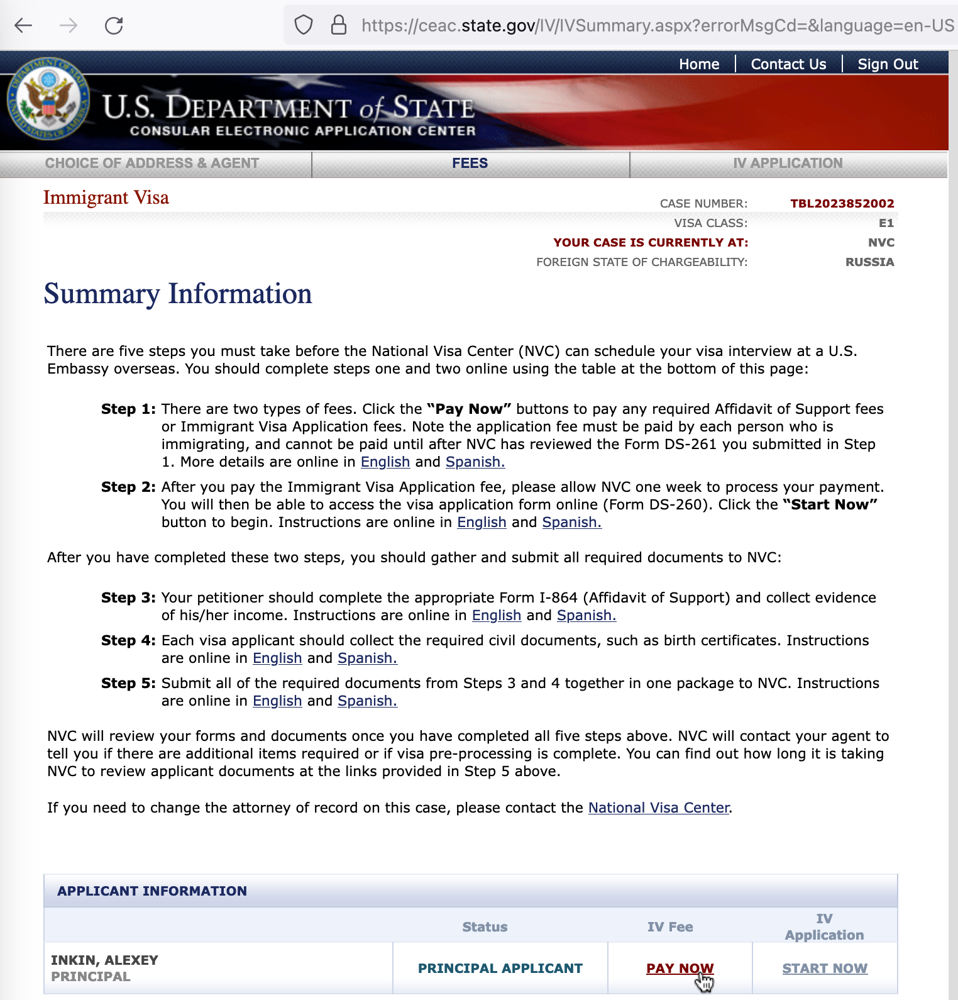
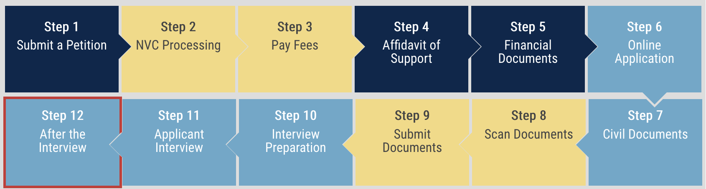
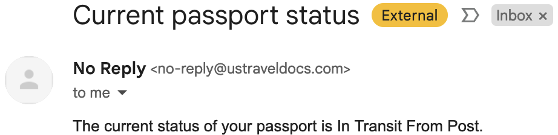
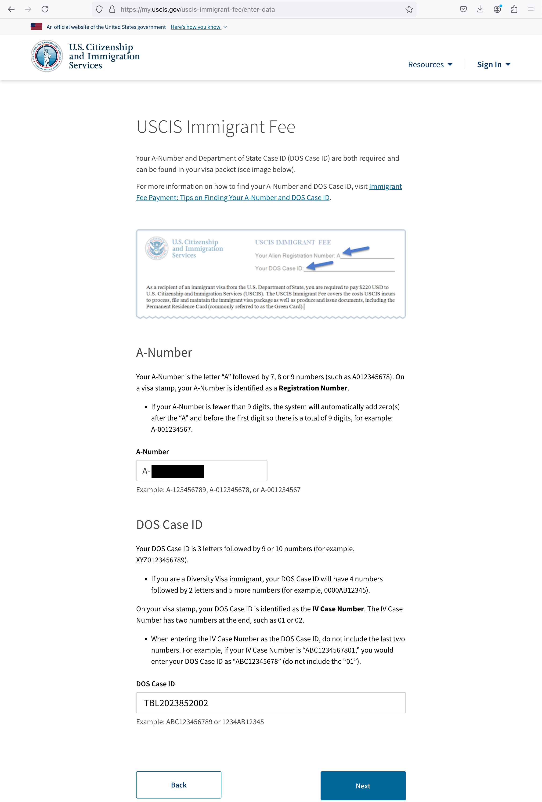
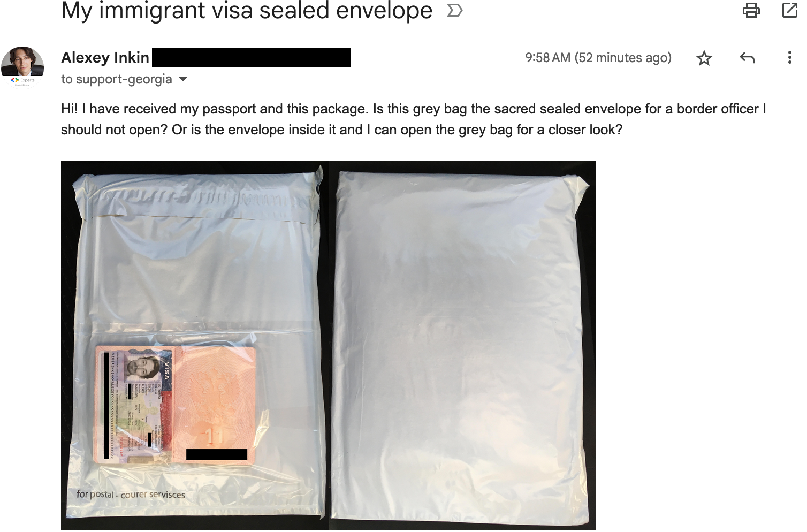
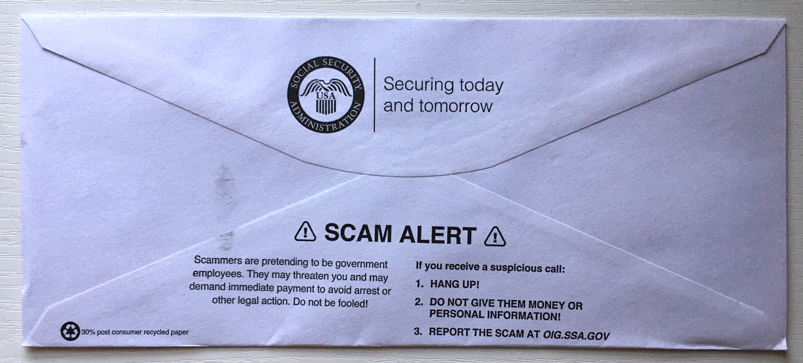
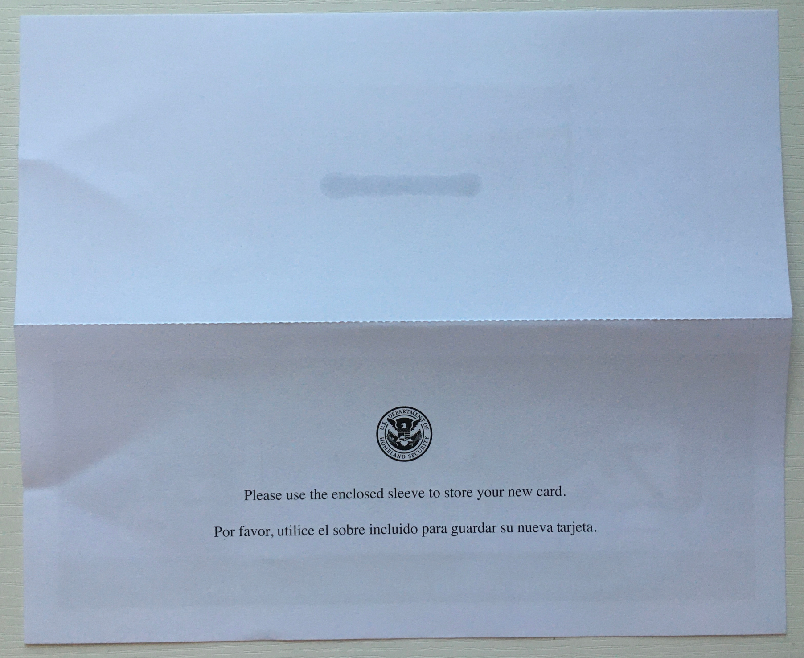

# The Process: How I got my EB-1A Green Card for Extraordinary Ability

<!-- 
Dec 1 - Day 1
Jan 1 - Day 32
Feb 1 - Day 63
Mar 1 - Day 92
Apr 1 - Day 123
May 1 - Day 153
Jun 1 - Day 184
Jul 1 - Day 214
Aug 1 - Day 245
Sep 1 - Day 276
Oct 1 - Day 306
Nov 1 - Day 337
Dec 1 - Day 367
-->

**TL;DR: If you are looking for my petition,
[download it here](https://github.com/alexeyinkin/eb-1a/releases/latest/download/inkin.pdf).**
The rest of this article describes the process *after* filing it.
The process of writing is described in
[a separate article here](../2-petition/README.md).


## The Process

Nothing here is legal advice.
This is just my experience with the system.

Since I was outside the United States, the process was the following:

1. I wrote a formal [petition](../2-petition/README.md)
   with the proof of my extraordinary ability
   to [The United States Citizen and Immigration Service (USCIS)](https://www.uscis.gov),
   known as I-140 petition.
   I printed it and sent it over physical mail.
2. They reviewed the petition.
   Normally, they either approve it on the first attempt
   or request additional evidence
   if they think some criteria are not completely proven.
   In the latter case,
   they write what exactly is not proven
   and suggest the documents you can supply.
   Mine was approved on the first attempt.
3. USCIS sent my approved petition
   to [The National Visa Center (NVC)](https://travel.state.gov/content/travel/en/us-visas/immigrate/national-visa-center.html),
   a US body that coordinates consulates in foreign countries.
   They contacted me and asked for some more papers
   (birth certificate, police certificate, marriage and military documents, etc.)
   At this point, they established the city
   where my final interview was to be held.
   I could have changed it later, but I was OK with it.
4. I mailed copies of those documents to them
   by physical mail.
5. The NVC replied that everything was complete
   and that I should wait for the interview date.
   If they miss any documents, they ask for them.
6. The NVC gave me my interview date.
7. I took a medical exam in a clinic
   approved by the Department of State.
   Typically, there is one in every city
   where they conduct interviews.
8. I came to the United States embassy
   in the given city for my interview.
9. My immigrant visa was approved right away,
   and they sent my passport back to me
   with a courier in a few days.
   Otherwise, if they were in doubt,
   they could have given me the passport back
   and taken more time for an additional security check
   (euphemistically known as *'administrative processing'*).
   It takes weeks to months, sometimes over a year.
   I could also have completely failed the interview
   and been rejected even after the petition approval,
   although this is rare.
10. I arrived in the United States before
    my immigrant visa expired.
    When my immigrant visa was stamped at the border
    I officially became a lawful permanent resident of the United States.
    My visa with the stamp is the legal equivalent
    of a green card for the first year.
11. I received my Social Security Number (SSN) card
    and the green card by physical mail.

If I was in the United States already
(tourist, work visa, studying, asylum, etc.),
the petition steps would be the same,
but after the approval of the petition
the process is different,
it's called *'the adjustment of status'*
to that of a permanent resident.

# My Timeline

- Jun 22, 2023 - Purchased [a video course](https://moovert.pro) and started working on the petition.
- [Nov 30, 2023](#day-0) - My US agent printed and mailed the petition to the USCIS.
- [Dec 2, 2023](#day-2) - Petition delivered to the PO box.
- [Dec 5, 2023](#day-5) - Petition taken from the queue, 'priority date' assigned, fee cheques cashed.
- [Dec 7, 2023](#day-7) - Received the email with the case number, the 15-day deadline started.
- [Dec 14, 2023](#day-14) - Petition approved, received the approval email.
- [Dec 15, 2023](#day-15) - Paper notice of approval issued.
- [Dec 19, 2023](#day-19) - NVC received the case from USCIS, issued the Welcome Letter, and requested further documents.
- [Dec 28, 2023](#day-28) - Received scans of the paper notice of approval and NVC Welcome Letter from my mail agent.
- [Jan 11, 2024](#step-7-civil-documents) - My US mail agent printed and mailed further civil documents to NVC.
- [Jan 16, 2024](#day-47) - Civil documents delivered to the PO box.
- [Jan 31, 2024](#day-62) - Civil documents acknowledged.
- [Feb 7, 2024](#day-69) - Email from NVC acknowledging the civil documents.
- [Sep 6, 2024](#day-281) - Email from NVC with my interview date.
- [Oct 3, 2024](#day-308) - Medical examination.
- [Oct 23, 2024](#step-11-applicant-interview) - Interview in the United States embassy.
- [Oct 29, 2024](#day-334) - Picked up my passport.
- [Nov 3, 2024](#day-339) - Arrived in Dallas.
- [Nov 12, 2024](#day-348) - Received my SSN by mail.
- [Nov 22, 2024](#day-358) - Received my green card by mail.

The legal process took 334 days.

# Overview

This is the entry point to the process:
https://travel.state.gov/content/travel/en/us-visas/immigrate/the-immigrant-visa-process.html

At the top, it shows all the steps:

[](https://travel.state.gov/content/travel/en/us-visas/immigrate/the-immigrant-visa-process.html)

The red frame shows the currently selected step.
That page is for all types of immigrant visas,
so it distinguishes between the petitioner
and the applicant.
For the EB-1A green card,
I was both the petitioner and the applicant,
so I disregarded the color codes.

# Step 1. Submit a Petition

I wrote my petition as completely described
[here in a separate article](../2-petition/README.md)
with all the processes for obtaining evidence
and my reasoning behind each point in it.

And here is the petition itself (clickable):

[]((https://github.com/alexeyinkin/eb-1a/releases/latest/download/inkin.pdf))

## Day 0

A petition had to be printed and sent over physical mail.
I had to sign it in a few locations
but didn't have to send the original paper I signed.
Instead, sheets with my signature
could be scanned and printed by someone else.

This allowed me to send the petition
from another location through an agent who printed it.
I used to live in [Georgia](https://en.wikipedia.org/wiki/Georgia_(country)),
and mail delivery was not reliable there,
and could take a long time.
So I asked my United States agent
to print and send my petition,
and this proved to be fast.
I also used their address for replies.

They printed and sent my petition on Nov 30, 2023.
I refer to this as *'Day 0'*, and days in this article are numbered from that date.

This is my printed petition with cheques on it.
There had to be separate cheques for processing
and for the priority service.
Note that both fees have increased since, and the third one was added.


The sheets were not clipped together,
because my agent said this way it was easier for USCIS
to process them.
Since they were not clipped,
my agent made sure the package was tight
so the sheets could not get messed up.

This is the final box:


USCIS has multiple processing centers,
and the address on the box was determined
by the state where I chose to reside.
Don't copy mine, find your address
[here](https://www.uscis.gov/forms/all-forms/direct-filing-addresses-for-form-i-140-immigrant-petition-for-alien-worker).

The petition was sent with the United States Post Service,
priority mail.
They gave me a tracking number.

## Day 2

On December 2,
the petition was delivered to the mailbox of USCIS:


It was Saturday, so nothing much happened for a while.

## Day 5

December 5 was assigned to me as the *'priority date'*.
It likely means that on that day they opened the box.
In some circumstances, this date is important legally.
For instance, other immigration programs
have a long waiting line even for approved petitions,
sometimes over a decade, and this date determines
when the petitioner can move to the next step.
Applicants born in some countries
have a long waiting line even for EB-1.
That was not the case for my country of birth,
so this date was never important to me.

On this day, nothing gave it out.
I only learned it later from the mail later.

## Day 7

On December 7, I received an email with my case number.
I believe this officially started
the 15-day priority review period.


It was December 8 in my timezone,
but here and on I use the US time for night events.

From this email,
I've learned that I could speed up communication
if I put my fax number on my forms.
Unfortunately, my agent didn't have a fax
and didn't tell me about that option.

Fax would have been important
if the officer requested more evidence from me.
Normally, in that case, one only gets an email
that the evidence is requested, but no details,
and then one has to wait for the papers in physical mail,
non-priority.
It can take many days one could otherwise use
to prepare the requested evidence.

On that day, they sent a paper notice of cashing my cheques
(see [below](#day-18)).
This and all following mail were sent
to the mailing address from the I-140 form.

In a subsequent petition I was helping my customer with,
they put the fax into the form.
They did not get the RFE over fax anyway,
but they were able to have USCIS send them the scan over email.
My customer used [eFax](https://efax.com).

## Day 14

On December 14, I received an approval email:


I was mad for them putting my Skill Level at zero, but if that's the cost, alright.

## Day 15

On December 15, they printed a notice of approval and mailed it to me
(see [below](#day-28)).

## Day 18

On December 18,
my mail agent sent me a scan of the notice
that my cheques were cashed, issued 11 days ago:


# Step 2. NVC Processing

[](https://travel.state.gov/content/travel/en/us-visas/immigrate/the-immigrant-visa-process/step-1-submit-a-petition/step-2-begin-nvc-processing.html)

## Day 19

On December 19, USCIS transferred my case to the National Visa Center,
and they sent a Welcome Letter to me (see immediately below).

## Day 28

On December 28, my mail agent sent me the scans of my
paper approval notice issued 13 days ago
and the Welcome Letter from the NVC issued 9 days ago.

The approval notice:


The NVC Welcome Letter (clickable):

[](media/28_nvc.pdf)

It's identical for everyone
except for addresses and numbers,
including applicants with totally different categories.
It had a list of documents I needed to mail them
to continue,
and most of them were only applicable
to sponsored immigration, so I disregarded them.

I immigrated alone.
Those who have families on their application
would have page 4 repeated for each of them
with different data.

The most important things in the letter were:

- **The case number** on page 1.
  It's different from the USCIS case number,
  and it started with the alpha code of the city
  where my interview was meant to be.
  It was "TBL" for me, standing for Tbilisi.
  The city was also mentioned at the bottom of page 1.
  
- **Invoice ID** on page 4,
  different for each of the family members.

The letter directed me to this address
as a home page for everything while dealing with NVC:
https://ceac.state.gov

# Step 3. Pay Fees

[](https://travel.state.gov/content/travel/en/us-visas/immigrate/the-immigrant-visa-process/step-1-submit-a-petition/step-3-pay-fees.html)

## Day 29

I paid the fee.

The first thing the NVC letter told me to do was to pay the fee for my visa:


Without the payment, the button to start the visa application
was disabled:



The next page listed all the fees I had to pay.
For the immigration programs that require an affidavit of support,
there is a fee to process that affidavit.
On EB-1A, I don't need that, so the only fee was to issue
my immigration visa.
"IV" stands for immigration visa,
and this acronym will be seen a lot here.

This page also showed that the payment was not instant
and took a few days to process.
This is why I should have started it immediately after receiving
the NVC Welcome Letter with my numbers.


The payment page requires my routing number and account number.
These are the standard credentials for US banks,
and this is why cards from other countries don't work
-- they just don't have that.

In the case of Bank of America,
I had to sign in, select an account, and click 'Account & routing numbers'.
I used the account number and the routing number for *'Paper & Electronic'*:


I couldn't do anything else until they got the payment,
only check its status:


## Day 34

The status changed to "Paid" on January 3,
taking 2 business days.
I received no email on that,
and even Bank of America sent me no push notification
because it was not a card transaction.

# Step 6. Online Application

[](https://travel.state.gov/content/travel/en/us-visas/immigrate/the-immigrant-visa-process/step-5-collect-financial-evidence-and-other-supporting-documents/step-6-complete-online-visa-application.html)

After the fee was accepted,
the 'Start Now' button became enabled:


It leads me to form DS-260 'Online Immigrant Visa and Alien Registration Application'.

I prepared the online application and the civil documents (the next step) together.
This is because:

1. They both had to be submitted
   to advance to the next stage, in any order.
2. The answers I put in the online application
   influenced what civil documents I needed.

## Day 42

I lost 9 days from not having the required documents at hand.
I didn't expect the NVC mail that quickly
because people were saying it takes at least 2 weeks
and more often a month, sometimes much longer.
I should have timed the preparation of my documents
so that I could mail them immediately
after the NVC accepted the fee.

DS-260 is a long form,
and they estimate it to take 155 minutes to fill out.
It took me something about that.

The form was automatically saved
every time I moved to the next or previous step.
After 20 minutes of inactivity, it would sign me out,
and I would have lost what I entered in the current step.

If signed out,
I could continue via the same link I used to start it,
which now read *'Incomplete'*:


My complete DS-260 form is here (clickable,
again not legal advice as is everything here):

[](https://github.com/alexeyinkin/eb-1a/releases/latest/download/ds-260.pdf)

It was straightforward except for a few points:

- I needed to supply a US address where my green card
  and social security card would be delivered.
  Not many people know that address in advance.
  However, I had friends in Texas
  where I planned to stay for some time,
  so I put their address, phone, and name
  in *'Mailing and Permanent Address'*.

- On the Training page, I answered *'Yes'*
  to the special skills question.
  I took 3 lessons on handling a pistol in 2013–2015
  but didn't remember much.
  I don't believe I had a *'skill'*,
  but I had it in 2015 on my DS-160 form
  for a tourist visa,
  so I thought to better be safe than sorry
  if they matched the two forms.

- On the medical page, I was not sure
  if I had all the required vaccinations,
  but I knew I would get all the missing shots
  during the medical examination,
  so I thought 'Yes' was alright here.
  Later I learned that many countries
  don't have all shots available,
  and it's common that people pass an interview
  with some of the shots missing.
  They need to get the missing ones in the US.
  So there's a possibility that 'Yes' would be false here.
  I should have answered 'No'.
  That would have opened a text field where I would say
  I planned to get as many of the missing shots
  as possible during my medical examination.

When I confirmed, I got to 'sign' the form:


I submitted it on January 11, 2024.


After that, this page was always available after signing in
to the website and navigating to sign the form.

# Step 7. Civil Documents

[](https://travel.state.gov/content/travel/en/us-visas/immigrate/the-immigrant-visa-process/step-5-collect-financial-evidence-and-other-supporting-documents/step-7-collect-civil-documents.html)

Also on that day,
my agent printed and sent the package of documents to the NVC (clickable):

[](https://github.com/alexeyinkin/eb-1a/releases/latest/download/nvc.pdf)

This package is overkill,
but that's fine because I'm a serial overkiller.

I've heard that military records are not required
for one who did not serve in the army.
But I decided to attach my military records
that read *'did not serve'* explicitly.

Also, I was detained at a
[Navalny's](https://en.wikipedia.org/wiki/Alexei_Navalny) rally once.
It was political, so it was not an issue
for the US authorities.
It was a detainment and not an arrest,
and a detainment is a milder procedure.
However, the European Court of Human Rights
in its ruling translated that as *an arrest*.
That's why I decided to answer *'Yes'*
to the arrest question in the DS-260 form,
and so I attached both court rulings on the matter.
I decided it would be worse to answer 'No'
and then have them google
"Alexey Inkin arrest" and find that ruling.

Of the civil documents, I sent two only partially:
- To save on translation, In the military records book,
  I have chosen the pages I felt were the most important.
- In the judgment by The European Court of Human Rights,
  I dropped a few trailing pages with the names
  of other people on the same case.

Later I thought that was risky.
There was nothing I could have gained
by submitting the incomplete documents,
but in the worst case, I could have lost a month
doing another round of papers.

## Day 47

At my request, my agent has used priority mail.
However, he also requested a signature upon delivery
for more reliability,
and I believe that was wrong.

Last time my petition was delivered to the drop box
on Saturday
because it did not require a signature.
This package could also have been dropped on the weekend,
but it had to wait until the next business day.
I am not sure how the packages from the drop box are prioritized,
but I doubt that Tuesday was better than the Saturday before.


Well, at least it was signed by J. Washington.
I wonder if they have a premium plan to get it signed by G. Washington.

## Day 53

Then was the long wait time.
[This page](https://travel.state.gov/content/travel/en/us-visas/immigrate/nvc-timeframes.html)
shows the progress of the NVC reviewing the civil documents.
They aim to update it weekly on Monday, but sometimes they forget.


Again, the frustrating thing was I didn't know
if the postage was in the line to be processed.
They don't show
whether the package was received on their end.

## Day 60

Next week, they were processing the documents
received 3 days past mine:


And I still haven't heard from them.

So I submitted
[the public inquiry from](https://nvc.state.gov/inquiry)
to learn my status:


They showed a confirmation:


## Day 61

22 hours later, they replied that they had received my civil documents
but ignored my other 4 questions:


Well, at least they answered the most important question
and the primary risk was resolved.

I think it's wise to inquire that just when the delivery date
gets behind the published processing date.
It's the earliest chance to know the mail was not lost.
Technically, I could have inquired about it any time,
but they asked not to until my date
is behind their published processing date.

## Day 62

My civil documents were accepted on January 31.
It was 15 days after the package was delivered to them.
I learned this date much later.

## Day 67

Another week has passed:


I inquired again:


## Day 68

On the next day, they replied that my documents were accepted
and I should wait for an available interview date:


That was 21 days after the package was delivered to them.

## Day 69

Over the US night,
I received the regular email notifying of the same:


And the attachment:


## Day 115

I met another guy with an approved EB-1A petition in my city
with the nearly identical timeline.
He had this long wait too,
which made it less probable that my case was lost.
On March 24, he inquired them about the status
with the same public inquiry form.

## Day 117

The NVC responded to the guy with a generic text
that they rely on the consulate to give them time slots,
and that they can't predict anything.

## Day 123

On March 31, the NVC sent an automatic email
that my case was still with them
waiting for the appointment slot to be allocated.
At least they thanked me for my patience.

I celebrated my first commendation
from a foreign government.

This letter also mentioned
that my case had been in this status since January 31.
This is how I learned that date I mentioned earlier.

They said they would have been sending such automated emails
every 60 days until I got my appointment.


## Day 164

On May 12, I send this inquiry
to estimate the number of people ahead of me:


## Day 167

They replied with nothing:


## Day 183

On May 31, the NVC sent an automatic email
that my case was still with them
waiting for the appointment slot to be allocated. Again.


## Day 243

On July 30, the NVC sent a third automatic email
that my case was still with them
waiting for the appointment slot to be allocated.


## Day 281

On September 6,
I was routinely checking the case status
at https://ceac.state.gov
and noticed it changed from 'At NVC' to *'In Transit'*.
It also said that my interview was scheduled:


This status usually predates the actual email
with the date.
Some see this status change a week in advance
of receiving an email.
My status might have been like this for days already
as I was not checking it regularly.

A few hours after noticing the status
I got the email on the appointment:


And the attachment:


The attachment contained the Case Master ID
which coincided with my invoice ID
from the original NVC letter.
So no new numbers were assigned. 

Interestingly, NVC ended up assigning dates
not on a first-in first-out basis.
In the same city of interview, I know:

- A person with civil documents accepted 40 days before mine
  who got their appointment email on the same day as me
  but had an interview date 7 days after mine.
- A person with civil documents accepted one day before mine
  who got their appointment email 20 days after me
  and had an interview date 14 days after mine.
- A person with civil documents accepted 14 days after mine
  who got their appointment email on the same day as me
  and had an interview date the same day as me.

# Step 10. Interview Preparation

[](https://travel.state.gov/content/travel/en/us-visas/immigrate/the-immigrant-visa-process/step-10-prepare-for-the-interview.html)

On this step, the text directed me
to the home page is the page of the specific consulate.
Mine was this one:
https://travel.state.gov/content/travel/en/us-visas/Supplements/Supplements_by_Post/TBL-Tbilisi.html

Actions slightly vary depending on the country of the interview.

## Registering the Passport Delivery

After the successful interview, they could have delivered the passport:

- For pickup at the central office of the delivery service for free.
- For pickup at a different branch of the delivery service for $12.
- To any address in the country with a courier for $12.

To get there, I followed the link on the consulate page.
Note that they have since completely redesigned
the old USTravelDocs, and these addresses no longer exist.
You will have to find the new page
to register the passport delivery yourself.


On the next page, I had to enter the address even though I wanted pickup.


The final PDF after that to be printed for the interview:


## Day 284

The next business day, on September 9,
the NVC's status changed to *'Ready'*
which meant NVC had transferred the case to the consulate
and had nothing more to do with it:


I called the designated clinic and scheduled my medical exam.
They suggest having the exam a few days before the interview
to make the visa last longer
(to become a permanent resident,
one needs to arrive in the US on an immigrant visa,
and the visa is valid for 6 months after the exam).
However, I prefer doing things sooner,
and I scheduled the exam 20 days prior to the interview.

They gave me a list of things to bring.
In addition to what's on the consulate website were:

- Digital photo 3.5 × 4.5 on a disk or USB drive
  (the consulate said it's 3 × 4 cm
  for the medical exam,
  but the clinic specifically said otherwise).
- A printed page with my local address,
  US address, phone, and email.

## Day 286

On September 11, I got an email from the consulate
with a reminder of what they needed from me:


The attachment had this sheet for E visa:


This also updated the date in my case:


## Day 291

On September 16, my friends received the paper copy
of the appointment letter at the U.S. address
from my DS-260 form:


## Day 302

On September 27, I took my photos.
I said I needed a photo for a US visa,
and the photographer took this:


Then he erased the shadow and replaced the background with solid white:


I'm not sure such edits were allowed,
but I could not find a single photographer in Batumi
who had a set of two
[softboxes](https://en.wikipedia.org/wiki/Softbox)
to the sides of a person and made photos properly.

Then the photographer printed two of those
on a single page, 5 × 5 cm.
He used the same photo to crop it for the medical exam.

## Day 308

On October 3, I took the medical exam.
This part varies highly by country
and can be totally different for you.

I arrived at the designated time.
For 15 minutes, they were filling out the forms.
For some reason, they did it in
[the Australian immigration system website](https://emedical.immi.gov.au).
I gave them my digital photo on a flash drive,
3.5 × 4.5 cm.
They did not take my printed photos
and said that my case is all digital
despite the consulate website listing them
as required for the exam,
and the clinic required them as well 
over the phone earlier.

I showed them all my vaccination records,
handwritten files from the 1980s, and 4 COVID-19 shots.
They accepted all of them
and only made me take a flu shot
because it was the season
and renew my diphtheria shot from childhood.

The examination by the doctor was about 10 minutes long.
He measured my height (185 cm)
and mass (59 kg, and he said "not much").
He tested my eyesight
on a non-standard table without lighting.
He measured my pressure, 77 / 110.
He auscultated my heart, chest, and back.

He asked me:
- Whether I had any acute condition now.
- Whether I had any chronic diseases.
- Whether I smoked, drank, or used drugs.
- Whether I had any problems with organs (he named a few).
- Whether I had any psychiatric problems.

Then they took a blood test, 5 tubes.
No preparation for the test was required.

The doctor administered the flu shot himself
and sent me to partnering clinics:

- One for the chest X-ray scan.
- Another one for the diphtheria shot.

That was about it.
It may be longer for others,
I just look perfectly healthy.

The paper with my addresses, email, and phone
was not actually needed.
Had I forgotten it
I could just write it on a paper
and help them type it in.

They did not give me anything
and said they would send it all to the embassy.

## Day 310

I got a call from the clinic.
They said that the X-ray and all blood tests
came back fine, and I was fit for the visa.

## Day 312

The status date in my case was updated.
I believe it's the medical exam received by the embassy.


## Day 316

The status date in my case was updated.
I didn't figure out why.


## Day 327

One day before the interview,
at 12:34 they called me from the embassy from a hidden number
and asked if I was OK to be rescheduled from 9:45 to 12:30.
I agreed.

This updated my status date once again.


I arrived at [Apart Hotel West](https://www.booking.com/hotel/ge/west-t-39-bilisi.en-gb.html).
They are just minutes walk from the embassy.
Most of their residents come for the interview,
so they can last-minute print some missing papers for you
and keep an eye on your bag in the lobby
when you check out and go to your interview.
The room had issues, but overall I was happy.

My friends who have been through the process
advised me to take as many documents as I could.

Having so many,
I sorted them out into the following folders:

1. Originals of the required documents.
2. Copies & translations of the required documents.
3. Originals from the petition:
   supporting letters, membership cards,
   salary statements, etc.
4. All other minor papers.
5. Passports, current and all the expired ones.


I packed that into a light bag to simplify the security procedures:


By that time, I had improved my civil document package
over what I sent to NVC:

### Birth Certificate

I notarized the translation I submitted to the NVC
but forgot to scan it for my records.

### Certificate of No Impediment to Marriage

NVC took my word for not being married,
but for the interview, I had to prove that.
My parents back in Russia got this paper for me
from Civil Registration
using the power of attorney I gave them earlier,
and sent it to me.
For the interview, I had notarized this translation
but forgot to scan the notarization for my records.

[](media/unmarried.pdf)

### Police Certificates

The country of Georgia issues two types
of police certificates.

One is called 'ცნობა ნასამართლობის შესახებ'
('Certificate of Conviction').
It shows whether I have a current conviction.

Another one is called
'ცნობა გაქარწყლებული და მოხსნილი ნასამართლეობის შესახებ'
('Certificate of Expungement and Cancellation of Conviction').
It shows whether I ever had a conviction
that stopped showing on the first certificate for some reason.

At NVC, they were satisfied with the first one alone for me.
However, from one guy I knew they requested the second one as well
and showed him
[this page](https://travel.state.gov/content/travel/en/us-visas/Visa-Reciprocity-and-Civil-Documents-by-Country/Georgia.html)
as the source.

So I got the second one as well,
and it took them 3 business days at the cheapest rate.
This one they would only issue in the
[Service Agency of the Ministry of Internal Affairs](https://www.google.com/maps/place/Service+Agency+of+the+Ministry+of+Internal+Affairs+of+Georgia,+Batumi+Service-Center+%E1%83%A8%E1%83%A1%E1%83%A1+%E1%83%97%E1%83%91%E1%83%98%E1%83%9A%E1%83%98%E1%83%A1%E1%83%98%E1%83%A1+%E1%83%9B%E1%83%9D%E1%83%9B%E1%83%A1%E1%83%90%E1%83%AE%E1%83%A3%E1%83%A0%E1%83%94%E1%83%91%E1%83%98%E1%83%A1+%E1%83%A1%E1%83%90%E1%83%90%E1%83%92%E1%83%94%E1%83%9C%E1%83%A2%E1%83%9D/@41.6316392,41.6352785,15z/data=!4m6!3m5!1s0x406787833988d275:0x653b8bc979d8000a!8m2!3d41.6316392!4d41.6352785!16s%2Fg%2F11vb5ftmby?entry=ttu&g_ep=EgoyMDI0MTEwNi4wIKXMDSoASAFQAw%3D%3D).

They also offered to translate it into English
and put an apostille on it, in another 5 business days:

[](media/police-ge_no-expunged_public.pdf)

Since I went to the Ministry anyway,
I also got a fresh certificate of the first kind
which I submitted to NVC 9 months ago:

[](media/police-ge_no-current_public.pdf)

For the Russian police certificate,
I notarized the translation I sent to the NVC earlier
but forgot to scan it for my records.

### Court Records

I notarized the translation I submitted to the NVC
but forgot to scan it for my records.

### Military Records

I translated the pages I omitted when sending to the NVC
and notarized the translation
but forgot to scan it for my records.

[](media/military_public.pdf)

# Step 11. Applicant Interview

[](https://travel.state.gov/content/travel/en/us-visas/immigrate/the-immigrant-visa-process/step-10-prepare-for-the-interview/step-11-applicant-interview.html)

## Day 328

### The Scene

On October 23, I took only the bag, my phone,
some cash, and debit cards with me.
I left everything else at the hotel.

Many suggest coming well in advance.
Scheduled at 12:30, I arrived at 11:20.
There were no other visitors.
When they were looking me up in the list for the
day I saw about 30-40 people there.
I turned my phone off and left it in a cell
with the security at the entrance,
in exchange for a ticket.
The ticket said they were not responsible
for securing the item.
The cells were basically open shelves
by the guard's desk, not lockable.
They had a lot of cells, but they were small
and could not fit a tablet if I had it.
It's wise to take as few things as possible.
Some embassies do not have storage even for your phone,
so it's wise to ask in advance.
Cash and debit cards were OK to carry in.

The interview hall was empty.
A guard called someone and said they had a break
and I should come at 12:15.
So I went outside, picked up my phone,
and had an extra walk.

At 12:10 I arrived again.
This time there were 10 other people before me
in the line.
At 12:20 I switched off the phone, gave it in again,
and passed the security.
All security staff was local
with unit patches reading 'Local Task Force'.

There was a lot of waiting
before they collected our documents.
The interview hall had navigation and all bulletins
on boards in English, Georgian, and Russian.

There were 3 windows with local clerks
collecting the documents.
They called me.
The clerk spoke Russian and was very welcoming.
First, she got my fingerprints, and then the papers.

### The Papers

The clerk went through the list
similar to the one they [emailed me](#day-286).
When she saw that my police certificates were clean
she did not ask for court records,
so I proactively asked, and she took them.

There is some uncertainty
on whether the translations of the required documents
must be notarized.
Some embassies say it's required
but don't actually care.
Some embassies announce they don't need notarization.
My embassy required it on the website
and actually during the collection.

The clerk didn't take my diplomas,
supporting letters, or anything else.
She said an officer could ask for them
if they wanted to during the interview.
Then she told me to wait
until I was called for the interview by name.

Here is the summary of what I had in my folders,
what she proactively asked,
what she accepted after I asked,
and what they returned to me after the interview.

#### Originals Folder

| The Document                                | They asked? | They accepted?    | Returned? |
|---------------------------------------------|-------------|-------------------|-----------|
| Interview letter                            | —           | —                 | —         |
| DS-260 confirmation                         | —           | —                 | —         |
| Passport delivery registration confirmation | —           | —                 | —         |
| Photos                                      | ✅           | ✅                | —        |
| Birth certificate                           | ✅           | ✅                 | ✅         |
| Non-impediment to marriage                  | ✅           | ✅                 | —         |
| Police certificate RU                       | ✅           | ✅                 | —         |
| Police certificates GE                      | ✅           | ✅                 | —         |
| Court records RU                            | —           | ✅                 | —         |
| Court records ECHR                          | —           | ✅                 | —         |
| Military record book                        | ✅           | ✅                 | ✅         |
| Diplomas                                    | —           | —                 | —         |
| Resume                                      | —           | —                 | —         |

#### Translations & Copies Folder

| The Document                                     | They asked? | They accepted? | Returned? |
|--------------------------------------------------|-------------|----------------|-----------|
| Passport copy                                    | ✅           | ✅              | —         |
| Birth certificate notarized translation          | ✅           | ✅              | —         |
| Non-impediment to marriage notarized translation | ✅           | ✅              | —         |
| Police certificate RU notarized translation      | ✅           | ✅              | —         |
| Court records RU notarized translation           | —           | ✅              | —         |
| Military record book notarized translation       | ✅           | ✅              | —         |
| Diplomas, non-notarized translation              | —           | —              | —         |
| Birth certificate untranslated copy              | —           | —              | —         |

#### Originals Used in the Petition and Not Required By NVC or Embassy

| The Document       | They asked? | They accepted? | Returned? |
|--------------------|-------------|----------------|-----------|
| Supporting letters | —           | —              | —         |
| Contracts          | —           | —              | —         |
| Membership cards   | —           | —              | —         |
| GeoStat salary     | —           | —              | —         |


### The Interview

After some waiting, they called me to the window 5.
The officer was very friendly and enthusiastic,
like your ideal picture of an American,
the type of young [Matt Damon](https://en.wikipedia.org/wiki/Matt_Damon).
He was wearing a white shirt.
Here is my rough recollection of the interview. 

👨‍💼 Do you happen to have your petition with you?  
👨‍🌾 No, it's big.  
👨‍💼 Then I need some time to fetch it.  
👨‍🌾 I also have some amendments to my DS-260.  
👨‍💼 First I need to fetch the petition. I will call you again.

In a few minutes, he called me again. First, he took my fingerprints too.

👨‍💼 Please raise your right hand.  
👨‍🌾 First, I have the amendments to my DS-260.  
👨‍💼 No, first, the oath.  
👨‍🌾 OK.  
👨‍💼 Do you swear that the information in this form is full and accurate?  
👨‍🌾 Yes, with these amendments.  
👨‍💼 OK, what are the amendments?  
👨‍🌾 First, my local address in Georgia has changed. Second, to the question of the vaccination, I answered I had all the documents. But I didn't have them at the time of filing and only was supposed to get the missing shots at the medical examination. Third, I've learned some Spanish since.  
👨‍💼 I don't need any of that. :) So, you're applying for a visa of extraordinary ability. What is your extraordinary ability?  
👨‍🌾 I'm a software developer.  
👨‍💼 Tell me about your career as a software developer.  
👨‍🌾 I got my first job in my 3rd year in university. It was a company that was doing firmware for Motorola phones. I was making an internal website for communication and for managing contracts. Then I launched my first start-up. It was a software marketplace. I maintained it for 10 years. Then I was a freelancer making websites for small businesses. Then an educator hired me as a CTO...  
👨‍💼 Do you live in Tbilisi?  
👨‍🌾 In Batumi, for two and a half years.  
👨‍💼 Did you ever work in America?  
👨‍🌾 Not in America but for an American company.  
👨‍💼 What company?  
👨‍🌾 Named Akvelon. They do outsource software development.  
👨‍💼 In the United States, where are you going?  
👨‍🌾 Dallas.  
👨‍💼 Why Dallas?  
👨‍🌾 I have friends there. Near it, the town of ___.  
👨‍💼 What are you going to do in the United States?  
👨‍🌾 I'll get a job as a software developer. It's another reason for Texas, by the way, it recently became a hub for IT.  
👨‍💼 Your visa is approved.

That was it. Felt like ~5 minutes.
Throughout the entire interview, there was no tension, catch, or anything unpleasant.
Just a talk of two enthusiastic people.

He returned my birth certificate and my military record book
and gave me a paper on how to get my passport back,
how to pay the final green card fee, and how to travel:


The officer said the paper was true
except the delivery service was TLS Contact instead of FedEx.

The QR codes decoded:

- Passport Tracking: https://ustraveldocs.com/ge/ge-niv-passporttrack.asp [broken]
- USCIS Immigrant Visa Fee: https://www.uscis.gov/forms/filing-fees/uscis-immigrant-fee
- USCIS Welcome Guide: https://www.uscis.gov/sites/default/files/document/guides/M-618.pdf
- Customer service:
```
support-georgia@ustraveldocs.com
Immigrant Visa Question
Hello,

My case number is:
```

Many people who do not get approved immediately
share that they felt like the decision was made before the interview.
When they were called to the window,
the officer already had on the table a sheet of paper
with a specific reason to put them on a security check.

I felt like the decision was made in advance too,
but there was no clear indication of that.
That sheet of paper the officer fetched from a shelf beside him,
he indeed had a few templates of different colors there.

My idea is that USCIS communicates to NVC and then to the consulate
not only that the case was approved
but also how satisfied they were.
The officer sees those hints and goes easy or hard on you.

The family after me was interviewed by the same officer.
He said to them that he needed one more week to familiarize himself with their case.
That was unusual.
After all, why set up an interview if you haven't done your homework?
Of tens of EB-1A interview stories I got to know, it's only the second one of this kind.
The officer issued a
[221g](https://travel.state.gov/content/travel/en/us-visas/visa-information-resources/visa-denials.html)
refusal to them because anything except an immediate approval is formally a refusal.
He gave them a paper saying something like that more verbosely.
He didn't give them their passports back,
which suggests he was about to approve them.
Otherwise, an officer normally gives you the passports back
if they lack some document from you or anticipate a long or indefinite check.
Actually, this was the second-best thing that could happen to them at the interview.

Windows 7 and 6 were holding tourist visa interviews.
Window 7 read 'English', and in window 6 the officer was able to speak Georgian (and likely Russian, but I was not sure).
While I was waiting, I witnessed one interview in the window 7 and two interviews in the window 6.
I could hear them all, both the officers and the applicants.
All were approved and went easy.

At my hotel, the receptionist said that she could read the faces of all the guests coming from their interviews.
She said that 60--70% are approved on average.

### Follow Up

Soon my status changed to 'Administrative Processing':


'Administrative Processing' is an umbrella term
for anything happening after the interview and before the visa is issued.
It dabbles as a euphemism for security checks
which can run for months or in extreme cases even years.
Fortunately, in my case, it was just the genuine necessary processing to print the visa.


# Step 12. After the Interview

[](https://travel.state.gov/content/travel/en/us-visas/immigrate/the-immigrant-visa-process/step-10-prepare-for-the-interview/step-12-after-the-interview.html)

## Day 329

My status changed to 'Issued':


The link at the bottom led here and was broken: https://georgia.usembassy.gov/contact-us.html

A few days before, they had just killed the old USTravelDocs.com which was there for years,
and which I took screenshots of passport delivery registration from.
All links in all previous letters and other DoS websites suddenly got broken.
So was the link on my red paper to track my passport.
It redirected me to the new home page at https://www.ustraveldocs.com

There I selected the country of Georgia: https://www.ustraveldocs.com/ge/en/

And then 'Immigrant Visa': https://www.ustraveldocs.com/ge/en/immigrant-visa

It had a link for passport delivery: https://www.ustraveldocs.com/ge/en/step-6

That page suggested tracking by email:


They also mentioned a phone call option, which I always try to avoid.

## Day 330

I sent a plain-text email with my passport number as the subject and the body to [passportstatus@ustraveldocs.com](mailto:passportstatus@ustraveldocs.com)

In a minute I received a response:



Later I tried different content, both plain text and HTML.
Looks like the service only parses the message subject.


## Day 333

On October 28, I got an email
that my passport was collected from the embassy
by the delivery service:


The wording suggested they had collected the passport,
and it must be on its way to my city.

49 minutes later,
I requested the status from the auto-responder.
It showed *Ready For Pickup*:


It was too late.
The bad wording in the first email prevented me from picking it up the same day.


## Day 334

On October 29, I have picked up my passport.
For that, I showed my second passport and paid the delivery fee in cash.
The receptionist said that those without the second passport normally show their driver's license.

At the designated address was still FedEx and not TLS Contact.
It could be that in small cities local branches
buy franchises from multiple companies.

FedEx gave me this package after removing the bill of lading from the pocket:


This contained another package inside
with my passport in a pocket
open at the page with the visa:


**This marked the end of the US bureaucracy being the bottleneck in my immigration.**
The rest was my travel schedule, and even the final fee could be paid later.

With the data on the visa,
I was able to pay the fee for issuing a green card.

After a few steps, the address from the red handout brought me to
[the payment page](https://my.uscis.gov/uscis-immigrant-fee/enter-data).

The page required my case number and the A-Number.
The latter was found on my visa sticker
as the *registration number*.




After the payment, I got an email:


Meanwhile, the passport delivery status did not change immediately.
So it can't be used for real-time tracking if your passport was picked.

## Day 335

I wanted to learn if the grey bag
contained anything important for me
and if I could open it,
so I sent a request to the support
at the email indicated in the red handout:



I got an automated response:


Also, on that day
the passport delivery status changed to *Picked Up*:


## Day 337

They did not respond within two business days.
So I decided to play with fire and cut the corners of the bag.
That allowed me to peek inside
but still would keep the border officer sure
I hadn't tampered with the contents.

I saw a yellow paper envelope with a sheet with my data stapled to it:


I hoped to see the famous 'DO NOT OPEN' warning on the inner envelope
which would mean it was alright to remove the plastic bag entirely,
but I couldn't locate it and decided to not fiddle with it any further.

## Day 339

On November 3, I arrived at Dallas Fort Worth International Airport
from Batumi with a layover in Istanbul
and went to the border checkpoint for foreign nationals.

👨‍🌾 Hello!  
👮‍♂️ Hello! Immigrant visa?  
👨‍🌾 Yes.  
👮‍♂️ Got anything to declare?  
👨‍🌾 No.  
👮‍♂️ Have you come by Turkish Airlines?  
👨‍🌾 Yes.  
👮‍♂️ Please wait for me here.

Without taking my fingerprints,
the officer went out of his post and closed the passage before it.

👮‍♂️ Follow me, please.

We went to a door.

👮‍♂️ Let me open this door for you.

He opened it with his tag.

👮‍♂️ Please go in there, they will call you by name.

He closed the door after me.
There was a waiting room with about 30 seats and three windows.
A few bored people were sitting there.
It was very much like the scene from '[Upon Entry](https://www.imdb.com/title/tt22964884/)':


After a few minutes, another officer in the right-most window called me:

👮‍♂️ Mr. Alexey Inkin?  
👨‍🌾 Yes.  
👮‍♂️ Do you have papers with you?  
👨‍🌾 Yes.

I handed him the package.
Then he just stamped my visa:


👮‍♂️ This will serve as a proof of your permanent residency for the first year. The green card will arrive by mail in 4 to 6 months.

He then cut my plastic bag and got the envelope.
It did have a seal with stamps over it.

👨‍🌾 Would it be OK if I had opened this plastic bag?  
👮‍♂️ Yes, it's only the envelope I need. You can go.  
👨‍🌾 Is everything OK with the envelope?  
👮‍♂️ Yeah, let me check.

He opened it and quickly went through the contents.
There were all the documents they collected from me at the embassy.
The officer briefly paused at the medical exam.

👮‍♂️ Non-expired, fine. You can go.

He put my papers back into the envelope
and dropped it into a box with about 30 other envelopes
like mine.
He didn't take my fingerprints.
I went out through a different door into America.

I wanted to take a picture in the first minutes as a permanent resident
with a large American flag in the background,
which I believe I could easily find in any airport.
But I found none.

So we stopped at a random flag on the way to my friends' home,
1 hour and 20 minutes into my new status.


## Day 340

The support responded in 3 business days
and confirmed that I could have opened the package:


## Day 341

On November 5, my Social Security Card was issued,
but I would only learn this date later.

## Day 348

On November 12, I have received my Social Security Card by mail:





## Day 358

On November 22, I got the actual green card:


The numbers on the card are explained
[here](https://www.dshs.wa.gov/sites/default/files/ESA/eaz-manual/Reading%20a%20Permanent%20Resident%20Card.pdf).





# The Expenses

I spent **$7'334.76** to go through this program,
traveling to the US excluded:


| Date       | Amount            | In $             | Expense                                                                         |
|------------|-------------------|------------------|---------------------------------------------------------------------------------|
| 2023-06-22 | $1115             | 1115.00          | Moovert course                                                                  |
| 2023-07-10 | $84.50            | 84.50            | IEEE membership for 2023                                                        |
| 2023-09-21 | $183              | 183.00           | IEEE membership for 2024                                                        |
| 2023-10-19 | 400 GEL           | 145.99           | Courier for the Georgian average salary statement                               |
| 2023-10-25 | 17500 RUB         | 194.68           | Translation from Russian with Moovert                                           |
| 2023-10-26 | 400 RUB           | 4.45             | Transcribing a TV piece                                                         |
| 2023-11-05 | 160 GEL           | 58.39            | Translation from Georgian with Alexander                                        |
| 2023-11-08 | $3200             | 3200.00          | I-140 & I-907 fees                                                              |
| 2023-11-20 | 22000 RUB         | 225.55           | Translation from Russian with Moovert                                           |
| 2023-11-22 | 7162 RUB          | 79.68            | Translation from Kyrgyz with iTrex                                              |
| 2023-11-22 | 1578 RUB          | 17.55            | Translation from Kyrgyz with iTrex                                              |
| 2023-11-24 | 5162.75 RUB       | 57.43            | Translation from Russian with Moovert                                           |
| 2023-11-30 | $333.60           | 333.60           | Printing the petition                                                           |
| 2023-12-25 | 39.10 GEL x 2     | 28.54            | Railroad ticket Batumi-Tbilisi-Batumi to order the Russian police certificate   |
| 2023-12-25 | 95 GEL            | 34.67            | Night in Tbilisi                                                                |
| 2023-12-29 | 22.50 GEL         | 8.21             | Police certificate from Georgia                                                 |
| 2023-12-31 | $325              | 325.00           | DS-260 fee                                                                      |
| 2023-01-08 | 8350 RUB          | 92.89            | Translation from Russian with iTrex                                             |
| 2024-01-08 | 39.10 GEL x 2     | 28.54            | Railroad ticket Batumi-Tbilisi-Batumi to pick up the Russian police certificate |
| 2024-01-08 | 95 GEL            | 34.67            | Night in Tbilisi                                                                |
| 2024-01-11 | 2370 RUB          | 26.37            | Translation from Georgian with iTrex                                            |
| 2024-09-11 | 5770 RUB          | 64.19            | Translation from Russian with iTrex                                             |
| 2024-09-16 | 430 GEL           | 156.93           | Notarizing the translations                                                     |
| 2024-09-24 | 52 GEL            | 18.98            | Georgian police certificates                                                    |
| 2024-09-27 | 126 GEL           | 45.99            | Translation of Georgian police certificates                                     |
| 2024-09-27 | 30 GEL            | 10.95            | Visa photos                                                                     |
| 2024-10-03 | 39.10 GEL x 2     | 28.54            | Railroad ticket Batumi-Tbilisi-Batumi for the medical exam                      |                      
| 2024-10-03 | 805 GEL           | 293.80           | Medical examination                                                             |
| 2024-10-03 | 117 GEL           | 42.70            | Night in Tbilisi                                                                |
| 2024-10-07 | 70 GEL            | 25.55            | Tetanus & Diphtheria shot                                                       |
| 2024-10-20 | 80 GEL            | 29.20            | Translation & notarization of a Russian Notarization                            |
| 2024-10-21 | 1220 RUB          | 13.57            | Translation of a Russian Notarization                                           |
| 2024-10-22 | 35.70 + 39.10 GEL | 27.30            | Railroad ticket Batumi-Tbilisi-Batumi for the visa interview                    |
| 2024-10-22 | 128.59 GEL        | 46.93            | Night in Tbilisi                                                                |
| 2024-10-29 | 45 GEL            | 16.42            | FedEx passport delivery                                                         |
| 2024-10-29 | $235              | 235.00           | Green card fee                                                                  |
|            |                   | **7334.76** | **Total**                                                                       |

# Questions?

I started a chat to answer them all:

- https://t.me/eb1a_chat

Join and feel free just to say "Hi!"
I like to hear from those who want to come to this great country!

# Thank You!

A lot of people were helping me,
and most of all my parents who were solving tons of issues back home
and sending me the missing papers.

Some others wanted to stay anonymous, so let me just show
the nationalities of this global squad of lovely people those helping me:

🇧🇾 Belarus  
🇩🇪 Germany  
🇮🇳 India  
🇮🇹 Italy  
🇲🇽 Mexico  
🇷🇺 Russia  
🇬🇪 Sakartvelo  
🇪🇸 Spain  
🇨🇭 Switzerland  
🇺🇦 Ukraine  
🇺🇸 United States  


This article is a part of the series:

1. **The Process [You Are Here]**.  
2. **[The Petition](../2-petition/README.md)**.  
   Download my entire petition and read
   how I chose my criteria and what to submit for them.
3. **[Improvements to the Process I suggest](../3-improvements/README.md)**.  
   If you work for the Department of Government Efficiency,
   read my suggestions on how to get the process from months to days
   and gain millions from immigrants paying their taxes early.
4. **[How I can help you with your petition](../4-help/README.md)**.  
   I can answer any questions that do not require a lawyer's license,
   try to evaluate your profile for the EB-1A program,
   give you career advice that would strengthen your profile for the program,
   proofread your petition, and more.

Read them all.
Follow me to keep in touch:

- Telegram: https://t.me/ainkin_com
- Twitter: https://x.com/AlexeyInkin
- LinkedIn: https://www.linkedin.com/in/alexey-inkin/
- Instagram: https://www.instagram.com/alexey.inkin/
- Facebook: https://www.facebook.com/alexey.inkin
- VK: https://vk.com/ainkin
