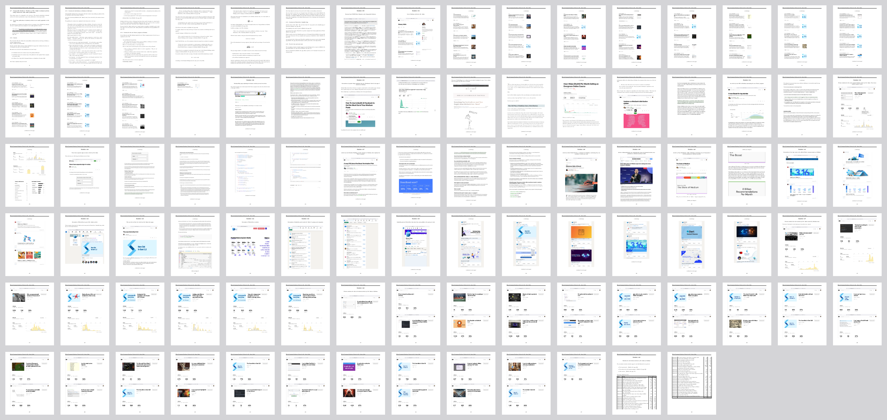
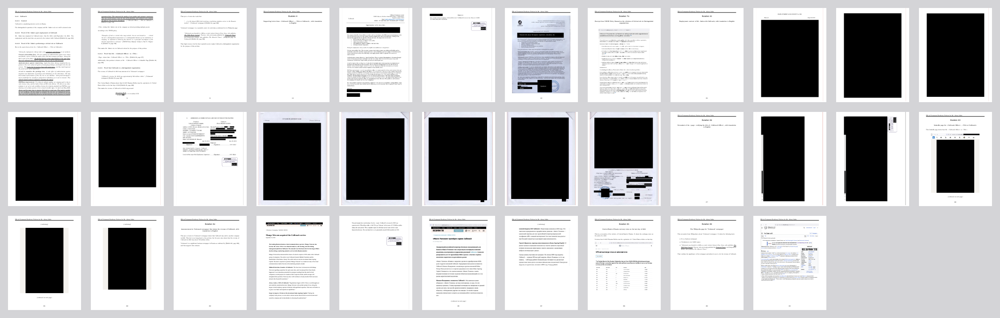
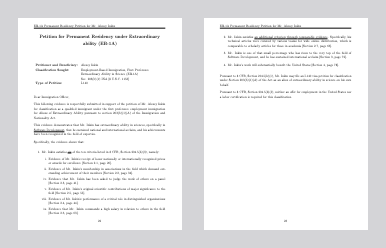

# How I Wrote my EB-1A Extraordinary Ability Green Card Petition which Was Approved on the First Attempt

I spent 4 months full-time writing my petition
starting on June 22, 2023, and filing it on November 30, 2023.
The petition was approved shortly after on December 14
without any additional requests.

I'm not licensed to give legal advice,
so nothing here is legal advice
but just my experience.


## My Petition

Click here to download my 557-page-long petition:

[](https://github.com/alexeyinkin/eb-1a/releases/latest/download/inkin.pdf)


## How I Arrived at the Structure

My friend told me about this program
and that it was approachable and not only for Nobel Prize winners.
Then I watched [a webinar by a paralegal](https://visatalantov.com)
that explained the higher-level picture to me.
I realized that I probably qualified
and purchased a [$500-course](https://moovert.pro) on how to write the petition myself.
It was vague and confusing and left me puzzled about how to actually write the thing.

After a month like that, I stumbled on [a petition by Razvan Marinescu](https://github.com/razvanmarinescu/EB1A),
a Romanian-British scientist who was approved for EB-1A and published his entire petition.
It clicked, and then my full-time phase began.

Some people are readily qualified for the program.
They don't need to present many details
because each one is stunning.
Razvan was like that, and his petition was short,
with 4 solid criteria (there are the total of 10 criteria in the program, one must meet any 3 of them), only 25 exhibits,
and *just* over 150 pages long.

On the other hand, my qualification for the program
was less straightforward,
so I had to provide more proof
and be careful in explaining every point.
I extended the logic I had seen in Razvan's petition
to 3 other criteria (I used 7)
and improved the navigation a little bit.


## The Structure

This is the structure I borrowed from Razvan.
It's not prescribed by any regulation.
It's just what he or someone else before him came up with
that helped the reviewing officer determine that one fits the requirements of the program.

I will explain this structure below,
what I started with, and how the sections influence one another
so the whole thing could have been written in a natural way.

To the right are the length of each section in my case.
From what I know, these are typical but can vary greatly.


## The Writing

Until I discovered an example petition,
it was frustrating to write any part
since I knew it was hundreds of pages
with unclear progression of assertions.

So I just cloned the example petition and replaced
the name with mine,
the basic facts,
the passport scan,
and other low-hanging fruits.
It immediately gave me a boost of self-confidence.

Starting right away helped me a lot.
If you want to start right away,
jump to [Writing Your Petition](#writing-your-petition),
and then back here.


## The Field

This is the most important thing to start with.
You can't just show your awesomeness in all spheres of life.

The field must be chosen first.
For example, one may be a professional on their job
and also grow to start their business in that same field.
They may apply as a professional in that or as a business person.
A teacher in some art may apply as a teacher or as an artist.
Those decisions impact the petition heavily.
Some evidence will work for one field and not for another one.

People normally choose a few options and brainstorm
what evidence they have
and what they can easily score for each path.

For me, the field was a no-brainer
because I had only one that was promising.
I have chosen science and the field of *Software Development* within it.


## The Algorithm of Writing

If I had to do this again, I would go in this order:

1. Brainstorm the instances in which I meet the criteria.
2. Describe those instances in text and prepare exhibits that support those claims **[takes 90% of the time]**.
3. Write the Final Merit Determination with every achievement that didn't work towards a criterion.
4. Write the Summary from the criteria texts.
5. Write the Benefits for the United States from my immigration.
6. Write my Work Plan in the United States.
7. Write a Conclusion from all of that.
8. Write a Cover Letter.
9. Fill out the forms.
10. Update the Table of Contents.

Up next is how I did all of that.


## Step 1. Brainstorm the Instances in which I Meet the Criteria

The 10 possible criteria are described
[here in short](https://www.uscis.gov/working-in-the-united-states/permanent-workers/employment-based-immigration-first-preference-eb-1)
and in detail in [The Policy Manual](https://www.uscis.gov/policy-manual/volume-6-part-f-chapter-2).
Any work should start with reading them thoroughly.

My bad was that I didn't trust the governmental language to be understandable,
so I didn't even try to read that until I purchased a course to help me with the program.
It happened to be the reverse.
The course was confusing,
but the official program description was simple and clear.

### My Criteria

I brainstormed what I could present for each criterion.
For some, it was multiple instances.
I aimed not only for the high number of the criteria
but also for the high number of instances of those criteria.

#### I Already Had:

- Award: ['Digital Breakthrough' hackathon](https://hacks-ai.ru), a podium place.
- Critical Role: [Apache Beam](https://beam.apache.org).
- Critical Role: [Akvelon](https://akvelon.com).
- Critical Role: [Calltouch](https://www.calltouch.ru).
- Critical Role: [Sergey Gran's School](https://vk.com/gran.school).
- Contribution: [PHPStan](https://github.com/phpstan/phpstan).
- Contribution: [Flutter Code Editor](https://pub.dev/packages/flutter_code_editor).
- Salary.

#### I Could Get:

- Association & Award: [Google Developer Experts](https://developers.google.com/community/experts).
- Association: [IEEE Senior Membership](https://www.ieee.org/membership/senior/).
- Judging: [IEEE Senior Membership Review Panel](https://www.ieee.org/membership/senior/review-panel.html).

#### Comparable Evidence

[The Policy Manual](https://www.uscis.gov/policy-manual/volume-6-part-f-chapter-2)
has a convenient provision.
If a criterion is not readily applicable to one,
they can submit evidence of anything else comparable to that in nature and merit.

In my case, scientific articles were not readily applicable to me
because I work in the industry and not in academia.
So I submitted my Medium blog and explained how it was comparable.
More on this [below](#6-articles-comparable).


## Step 2. Describe Those Instances in Text and Prepare Exhibits that Support Those Claims

### Proving a Criterion

This excerpt from my petition shows
what a proven criterion looks like in isolation (clickable):

<!--
qpdf inkin.pdf --pages . 26-29,116,127,128,129-131,132-137,138-140,141-142,143,144 -- ../2-petition/media/excerpts/award-gde.pdf
-->

[](https://github.com/alexeyinkin/eb-1a/releases/latest/download/inkin.pdf#page=26)

[Download the excerpt](https://github.com/alexeyinkin/eb-1a/releases/latest/download/award-gde.pdf) | [Go to Page 26 in the petition](https://github.com/alexeyinkin/eb-1a/releases/latest/download/inkin.pdf#page=26)

This is the description of the
['Google Developer Expert'](https://developers.google.com/community/experts)
award from my petition.
Google gives this award to the top experts in the company's technologies
who also promote the use of those technologies.

Let's use this piece as an example to learn the algorithm I used to prove any criterion.

The proof of a criterion consisted of text in a free form
and some exhibits to support it.
All exhibits went to the end of the petition.
It's just to make this excerpt consumable
that I put them right after the text.

How did I write the text?
Each criterion had its own required progression of assertions.
This example describes an award,
and you can see there are 4 subsections here:

1. Proof of Mr. Inkin being the recipient of the award.
2. Proof of the criteria being excellence in the field.
3. Proof of no limitation to competitors except begin 18+ years old.
4. Proof of the international recognition of the award.

These subsections are directly derived from what I thought USCIS wanted to see.

#### Deriving the Subsections from The Policy Manual

In [The Policy Manual](https://www.uscis.gov/policy-manual/volume-6-part-f-chapter-2),
navigate to the first criterion ("Awards").
These logical points are explicitly mentioned:
- ***"First, USCIS determines if the person was the recipient of prizes or awards."***
This produced the first subsection for me.
- ***"Second, USCIS determines whether the award is a lesser nationally or internationally recognized prize or award which the person received for excellence in the field of endeavor."***
This produced the second subsection.
- ***"Relevant considerations... include... Limitations on competitors."***
This produced the third subsection.
- ***"Relevant considerations... include... The national or international significance of the awards or prizes in the field."***
This produced the fourth subsection.

In my petition, you can see that a criterion's subsections
are derived from
[The Policy Manual](https://www.uscis.gov/policy-manual/volume-6-part-f-chapter-2)
mostly always.
I would take everything that was required and make titles from it
so the officer knew where to look for each item on their checklist.

I ordered the four subsections to form a logical progression,
and also to lead the reader to the punch line at the end
that the award put me in the top 0.025% in my specialty.

[The Policy Manual](https://www.uscis.gov/policy-manual/volume-6-part-f-chapter-2)
had more to say on the criterion,
and I could have produced more subsections,
but I felt like my points were made.

#### Deriving the Subsections from The RFE Template

When the officer lacks some evidence,
they normally don't deny the petition right away.
Instead, they usually send out a Request For Evidence
and explain what one might add to address their concerns.

This Request For Evidence is a formal document,
and it has [a template available here](https://www.uscis.gov/sites/default/files/USCIS/Outreach/Draft%20Request%20for%20Evidence%20%28RFE%29%20Template%20for%20Comment/E11_RFE_Template_1-10-11.pdf).

This template has articulation prepared
for many possible deficiencies in the petition.
From what I've seen with my friends and customers,
when sending out an RFE,
an officer deletes the sections they are satisfied with
and writes something specific to the specific case.
The point is, the RFE Template can be used as a checklist
of what can go wrong
(of course, it only has the most common problems,
and each case can be deficient in its own unique ways).

In the case of the award criterion, the template has the following concerns:

- ***Award(s) Appear to be Local or Regional***.
This produced the fourth subsection in my text.
- ***Evidence does not Establish that the Basis for the Award(s) was/were Excellence in the Field***.
This produced the second subsection.
- ***Evidence does not Establish that the Award(s) are Related to Beneficiary’s Field***.
This added to the second subsection.
- ***Academic Awards Not Nationally or Internationally Recognized***.
This added to the fourth subsection.

To me, these hints went secondary
after [The Policy Manual](https://www.uscis.gov/policy-manual/volume-6-part-f-chapter-2) requirements.
I would first write the text on a criterion based on The Policy Manual requirements,
and then see if the RFE template could hint some improvements over that.

### Exhibits to Support My Claims

Every claim I made had to be supported by some exhibit.
Throughout the petition, I used a lot of various types of exhibits,
but mostly they were screenshots of public pages:


This means that almost 80% of the claims in my case
could be verified online without even calling anyone.
This could have been a factor in my approval.
This could also have been a factor
to the green light at my visa interview,
but you never know.

I will dive deep into the production
for each type of exhibits [soon](#formatting-the-exhibits).

Obviously, I found verifiable stuff better,
but sometimes I also used materials
that were hard or even impossible to verify when I had to.
In my opinion, they are better than nothing.

### Proving Each of My Criteria Instances

For your convenience,
I extracted the text on each instance of each criterion
and put exhibits it referenced just after it.
In my complete petition,
first went all the texts, and then all the exhibits.

Here I list the criteria in the order and with numbers
as they go in [The Policy Manual](https://www.uscis.gov/policy-manual/volume-6-part-f-chapter-2).
In the assembled petition,
I ordered them from the strongest for my case in my opinion
to the weakest,
so the order was a bit different.

#### 1. Award — Google Developer Expert

<!--
qpdf inkin.pdf --pages . 26-29,116,127,128,129-131,132-137,138-140,141-142,143,144 -- ../2-petition/media/excerpts/award-gde.pdf
-->

[](https://github.com/alexeyinkin/eb-1a/releases/latest/download/inkin.pdf#page=26)

[Download the excerpt](https://github.com/alexeyinkin/eb-1a/releases/latest/download/award-gde.pdf) | [Go to Page 26 in the petition](https://github.com/alexeyinkin/eb-1a/releases/latest/download/inkin.pdf#page=26)

This instance is entirely provable with public online data.
[Google Developer Experts](https://developers.google.com/community/experts)
is a Google-maintained community of independent experts.
[I had became one](https://medium.com/google-developer-experts/how-i-became-a-google-developer-expert-in-flutter-e13f88ea5461)
early into working on my case.
Regardless, I wanted to join for many other reasons,
and it took a long-term effort.

GDE is a community, but it can also be seen as an award,
and I could find two reasons for that:

1. Together with the membership, one gets a badge
on [their Google Developer profile](https://developers.google.com/profile/u/alexey-inkin)
that reads *'Was awarded the title of Google Developer Expert in 2023'*.

2. Google gives out [physical plaques to GDEs](https://www.google.com/search?client=firefox-b-d&sca_esv=58722b6aa619540f&q=google+developer+expert+plaque&udm=2&fbs=AEQNm0Aa4sjWe7Rqy32pFwRj0UkWd8nbOJfsBGGB5IQQO6L3J_86uWOeqwdnV0yaSF-x2jon2iao6KWCaVjfn7ahz_sf9q37Zv4dbJ4TW_6SnErfFZ77vWA-JewUZjVu3roP919JJ7LB0XgUlbeu3TIUlWj0Hp1JHzwq5YPaSgTTkAC-edWrnsX-_paLirvXRRRiouDZnf1O&sa=X&ved=2ahUKEwj7n7vB7LiJAxXNSfEDHYCOEi8QtKgLegQIERAB&biw=1320&bih=787&dpr=2),
and they look awardish, but I didn't have time to get one.

So my award claim had to rely solely on the badge.

Then I used the criteria from
[the application guide](https://developers.google.com/community/experts/assets/GDE_Program_Application_Guide.pdf#page=5)
to prove what GDE awarded for.

To support the international recognition,
I used
[a page at JetBrains](https://www.jetbrains.com/community/dev-recognition/)
that mentions they recognize our technical excellence
and community leadership.
Then I had to recursively prove the reputation of JetBrains,
and I used
[the StackOverflow survey data](https://survey.stackoverflow.co/2023/#technology)
that showed high usage of their IDEs.
Finally, I had to prove the reputation of StackOverflow,
and I used Wikipedia for that.

I don't like referring to Wikipedia as anyone can edit it,
and I've seen RFEs challenging references to Wikipedia.
However, that was not the center point for in claim,
so I thought it didn't matter much.
In a subsequent petition I was helping with,
my customer used [the LinkedIn page of StackOverflow](https://www.linkedin.com/company/stack-overflow/) with over 1.5 million followers,
and I think it was much better proof.

Finally, I showed that on LinkedIn,
[GDE](https://www.linkedin.com/company/experts-program/)
was more popular than
[Academy Awards (Oscars)](https://www.linkedin.com/company/academy-of-motion-picture-arts-and-sciences/).
I didn't hope much for this point,
it was formally OK but mostly for fun.
I don't like doing things without having fun.

I also used a supporting letter from Google.
One of the most important pieces of data in it
was the number of GDEs in my category (Flutter).
If I didn't have it, I could have taken screenshots
of [the GDE directory filtered by my category](https://developers.google.com/community/experts/directory?specialization=flutter).

#### 1. Award — Digital Breakthrough

<!--
qpdf inkin.pdf --pages . 30-33,154-160,161-162,163-164,165-166,167-168,169,170-171,172-176 -- ../2-petition/media/excerpts/award-lod.pdf
-->

[](https://github.com/alexeyinkin/eb-1a/releases/latest/download/inkin.pdf#page=30)

[Download the excerpt](https://github.com/alexeyinkin/eb-1a/releases/latest/download/award-lod.pdf) | [Go to Page 30 in the petition](https://github.com/alexeyinkin/eb-1a/releases/latest/download/inkin.pdf#page=30)

'[Digital Breakthrough](https://leadersofdigital.ru)' is
the largest hackathon in Russia.
It was often translated to English as 'Leaders of Digital'
so you can find 'LoD' acronym in the petition.

In 2021, this hackathon brand hosted 8 prestigious qualifying championships,
each awarding its own honors and prizes,
with top teams advancing to the final round at the year's end.

I was on the team named '[1DevFull](https://1devfull.com/en)', and we
[took the third place](https://rsv.ru/news/1/2581/)
in one of the tracks of one of the qualifying championships.
However, I opted out of competing in the final,
and the team [won the first place](https://rsv.ru/news/1/3818/) without me.

Luckily, each of those qualifying championships was national and not regional,
and had its own ceremony and cash prizes.
That allowed me to submit this award in my petition.

It was tricky to choose exhibits for this award
because the organizer [has deleted the website with the award records](https://medium.com/dev-publicity/how-russia-erased-2000-award-records-and-how-to-prevent-this-in-the-future-b8aa81690840).
I had the screenshots made before that
but decided to not use them
to not give an officer a pretext to issue an RFE.
So I scrapped what had been preserved in secondary sources.

News outlets
[preserved](https://rsv.ru/news/1/2581/)
the record of the award to my team,
so I included them.

A good idea was to use my bank statement
to show the cash prize wired to me,
but the wire was from an intermediary and could have proven nothing,
so I didn't include that.

I tried to obtain a paper diploma from the organizer,
but they said they could not issue anything
since the management had changed.

I had to include a digital diploma I had,
which was not a solid proof because anyone could photoshop that in minutes.

For better proof, I included the screenshot
of
[the broadcast of our team presenting our solution](https://youtu.be/53Pdbeo0EJc?si=Fq5eHnDjBex90tEk&t=13364).
It was preserved on the organizer's YouTube channel.

Finally, I approached one of the top officials who ran the event back then.
They were offended by their legacy being deleted,
and they gave me a LinkedIn recommendation confirming my award.
I have hidden this recommendation after my immigrant visa was approved
to not get that official overwhelmed with similar requests.

To prove that the award is in the field of software development,
I asked the official to put judging criteria into their LinkedIn recommendation for me.

As for the recognition of the award, that was easy.
My government goes far advertising this competition.
They
[announce](https://minobrnauki.gov.ru/press-center/news/anonsy/31762/)
it on the Ministry of Science website
and many other venues.
I also included Putin's decree that established the organizer's body.

All that said, I had to be extremely careful
to not make a false impression that I won the final,
which could have easily been formed if I had omitted some data.
I made sure the petition included the following quotes
in the text, and not just hidden in the exhibits:

- There were 165 teams.
- 40 teams advanced to the final of the competition.
- This *semifinal* turned out to be truly massive.

This was very important because if one hides a material fact in the petition,
they can be prosecuted for misrepresentation,
and their green card or even subsequent citizenship can be revoked.
A [material fact](https://www.uscis.gov/policy-manual/volume-8-part-j-chapter-3#S-E)
is defined as something that
> led to the person gaining some advantage or benefit
> to which he or she may not have been entitled under the true facts.

#### 2. Association — IEEE Senior Membership

<!--
qpdf inkin.pdf --pages . 34-37,177,178,179,180,181,182-183,184,185,186,187-188,189,190,191,192-194,195,196,197-200,230 -- ../2-petition/media/excerpts/association-ieee.pdf
-->

[](https://github.com/alexeyinkin/eb-1a/releases/latest/download/inkin.pdf#page=34)

[Download the excerpt](https://github.com/alexeyinkin/eb-1a/releases/latest/download/association-ieee.pdf) | [Go to Page 34 in the petition](https://github.com/alexeyinkin/eb-1a/releases/latest/download/inkin.pdf#page=34)

This one I joined specifically for the petition.
Read the full article on how I did it [here](https://medium.com/dev-publicity/how-i-became-a-senior-member-of-ieee-e7ce1f35dbae).
Pay special attention to the section *'Put what you want to be honored for'*.

It's debatable whether IEEE Senior Membership qualifies for EB-1A.
This membership requires *significant performance for 5 years*,
and an officer must decide how it compares to the *outstanding achievement*
that EB-1A requires for associations.
I know of cases where this membership was counted,
and I've also seen an RFE explaining why it does not count.

With the Senior Membership comes a senior card,
but everything else was ready before I received it.
So I submitted a photo of the regular membership card I got earlier.

To prove my senior level,
I submitted the greeting email.
If I received an RFE challenging the level,
my senior card would have arrived by then and I could submit a photo of it.

Then I had to prove that IEEE covers the field of software development.
I just put a screenshot of the IEEE website and a reference to Wikipedia.
I also added
[a piece of news of Samsung](https://news.samsung.com/global/daniel-ahn-and-michael-polley-of-samsung-electronics-named-ieee-fellows)
saluting their employees
who received a higher grade there, just for the quote that this is
the world's largest technical professional organization.

Now that I've learned that Wikipedia was not a reputable source
I would have attached [the IEEE's tax return publicly available on the IRS website](https://apps.irs.gov/pub/epostcard/cor/131656633_202112_990_2023051221221890.pdf)
where the goals of the association are stated.
I believe this evidence is stronger.

Then there was a challenging part about the required outstanding achievements.
I did my best to compare those levels
and used a quote from
[The Policy Manual](https://www.uscis.gov/policy-manual/volume-6-part-f-chapter-2) that gave me some hope.

The last thing to prove was that candidates for this membership
are judged by established professionals in the field.
I attached the screenshots from the IEEE website about that
and
[the profile of the committee chair at the time](https://www.linkedin.com/in/zuhainazakaria/).
To me, her profile was high.

Also, one of my three references was a very reputable software developer.
I didn't pick them deliberately and only learned of their status
when I started writing this section of my petition.
If I had to do this over again and was not in a hurry,
I would have researched my potential references
to pick the strongest ones.
I think that strong references may even make up for the uncertainty in the point of the outstanding achievements
if the officer is on the fence about it.

#### 2. Association — Google Developer Experts

<!--
qpdf inkin.pdf --pages . 38-40,116,127,128,129-131,132-137,145,146-149,150,151-152,153 -- ../2-petition/media/excerpts/association-gde.pdf
-->

[](https://github.com/alexeyinkin/eb-1a/releases/latest/download/inkin.pdf#page=38)

[Download the excerpt](https://github.com/alexeyinkin/eb-1a/releases/latest/download/association-gde.pdf) | [Go to Page 38 in the petition](https://github.com/alexeyinkin/eb-1a/releases/latest/download/inkin.pdf#page=38)

I decided to reuse GDE as an association
because it's most often defined as a community in its documentation.
In
[my public profile](https://developers.google.com/profile/u/alexey-inkin),
I had not only the award badge
but also *'Google Developer Experts member'* badge.

The EB-1A experts I purchased a course from
advised me to not do that because they have seen RFEs
saying that a single merit can only be used towards no more than one criterion,
but I decided to give it a try anyway.

To prove that the GDE is a community of experts in software development,
I used a quote from Google's letter I had.

To prove the requirement of outstanding achievements,
I just used the number of members.
I could potentially quote the number of Flutter developers worldwide
to establish a tiny percentage of those who got the distinction
as I did for the GDE award but for some reason I haven't done that.

To prove that the candidates for the membership are judged by international experts,
I quoted
[the official application guide](https://developers.google.com/community/experts/assets/GDE_Program_Application_Guide.pdf#page=7)
and attached the profiles of those interviewing me for the membership.
I didn't have any better proof than two emails
assigning the interviewers to me, so I had to use them.
I didn't want to bother those people asking for support letters.

#### 4. Judging — IEEE Senior Member Review Panel

<!--
qpdf inkin.pdf --pages . 41-43,179,180,181,182-183,195,201-202,203,204-206 -- ../2-petition/media/excerpts/judging-ieee.pdf
-->

[](https://github.com/alexeyinkin/eb-1a/releases/latest/download/inkin.pdf#page=41)

[Download the excerpt](https://github.com/alexeyinkin/eb-1a/releases/latest/download/judging-ieee.pdf) | [Go to Page 41 in the petition](https://github.com/alexeyinkin/eb-1a/releases/latest/download/inkin.pdf#page=41)

The Senior Member Review Panel
is recruited from IEEE members
in the ranks of Senior and higher.
Since I was a senior member anyway,
I asked them how to get on the panel.
They ended up inviting me.

As the proof of judging, I used the email invites,
the screenshots from the reviewer console,
and the Thank-You letter they sent me afterward.

As the proof of the allied field,
I just quoted the requirements for senior members.
If I had to do this over again,
I would also attach some profiles of the people I reviewed
who were software developers.
I think that would make a stronger point.

To prove the high requirements to be on the panel,
I quoted
[the web page on the review panel composition](https://www.ieee.org/membership/senior/review-panel.html)
which stated that one must be at least a Senior Member.

To prove the high rank of the applicants,
I quoted the requirements for the Senior grade.
In a subsequent petition I was helping with,
my customer attached the profiles
of some candidates they actually judged,
and their achievements were outstanding indeed.

Then, to prove the high rank of the association,
I quoted Wikipedia and Samsung again.
In a subsequent petition I was helping with,
my customer used the association's tax return publicly available from the IRS
that featured over 1 billion dollars in assets,
which I think was a killer point.

#### 5. Contribution — PHPStan

<!--
qpdf inkin.pdf --pages . 55-58,124,141-142,221,230,338,339,340-341,342,343,344-345,346,347,348,349-351,352,353,354-360,361-363,364-365,366-367,368 -- ../2-petition/media/excerpts/contribution-phpstan.pdf
-->

[](https://github.com/alexeyinkin/eb-1a/releases/latest/download/inkin.pdf#page=55)

[Download the excerpt](https://github.com/alexeyinkin/eb-1a/releases/latest/download/contribution-phpstan.pdf) | [Go to Page 55 in the petition](https://github.com/alexeyinkin/eb-1a/releases/latest/download/inkin.pdf#page=55)

[PHPStan](https://phpstan.org/)
is the most popular
[linter]()
for
[PHP](https://php.net)
programming language.

First, I established that I made an improvement in the PHPStan tool
by showing
[my PRs](https://github.com/phpstan/phpstan-src/pulls?q=is%3Apr+author%3Aalexeyinkin+is%3Aclosed).
Then I had to prove its significance.

Originally, I wanted to get a letter from
[Ondřej Mirtes](https://www.linkedin.com/in/ondrejmirtes),
the founder of PHPStan.
He initially agreed.
Then I told him I needed a physical paper
with his signature mailed to me,
and then he changed his mind and said he had no time for that.
I offered to send a courier to him to pick up the paper
or even to go with just a scan.
He has read those messages and never replied.
I believe he was afraid of misuse of his signature
because he only knew me briefly 3 years ago.

This is an example of how a piece of bad advice
from incompetent course authors can hurt your petition.
See [the section on supporting letters](#getting-the-support-letters) below
on how to not scare people away.

So I had to reach out to the broader PHP community
by cold-mailing the world's top developers.
The response rate was below 10%,
most of those who responded refused,
and I noticed my messages going to spam after a while.

After all, my message was really awkward:

> Hi. You don't know me, but I made an improvement
> in a tool you've heard of but not necessarily use.
> Can you please look at it and certify it was significant?

My actual words were better,
but the meaning was still this.

Finally, I found two prominent figures
who agreed to support me.
Then I quoted them to prove the significance of my contribution.

I asked the first expert to write the letter in two parts.
The first part was in simple words
for the officer to get a general idea,
and the second one had technical details
should anyone care to learn them or challenge my contribution.

As for Ondřej Mirtes,
I quoted just
[his comments](https://github.com/phpstan/phpstan/issues/306#issuecomment-625773223)
to the issues that my contribution had solved.

Then I had to prove the wide use of PHPStan.
Luckily,
[the download statistics](https://packagist.org/packages/phpstan/phpstan/stats)
was available in the package repository for PHP.
So I only had to quote it and explain in simple words what the repository was.

#### 5. Contribution — Flutter Code Editor

<!--
qpdf inkin.pdf --pages . 59-62,116,118,125-126,231-235,249-251,369-371,372,373,374,375-376,377,378-381,382,383-384,385-386,387,388,389-391 -- ../2-petition/media/excerpts/contribution-fce.pdf
-->

[](https://github.com/alexeyinkin/eb-1a/releases/latest/download/inkin.pdf#page=59)

[Download the excerpt](https://github.com/alexeyinkin/eb-1a/releases/latest/download/contribution-fce.pdf) | [Go to Page 59 in the petition](https://github.com/alexeyinkin/eb-1a/releases/latest/download/inkin.pdf#page=59)

To give an officer context, I started by explaining what
[Flutter](https://flutter.dev) was
and what [Flutter Code Editor](https://pub.dev/packages/flutter_code_editor) was
(a code editor component that could be used in any Flutter app).

To prove that I was the primary author of the editor,
I quoted the support letter from Akvelon where I worked back then,
[the commit count at GitHub](https://github.com/akvelon/flutter-code-editor/graphs/contributors),
and [an article in Akvelon's blog](https://akvelon.com/flutter-code-editor/).

Then I had to compare various code editors in Flutter.
This was tricky because there was no dedicated rating of those that was reputable.
The best we could go with was
[FlutterGems.dev catalog](https://fluttergems.dev).
It is a classifier of popular Flutter packages
maintained manually.
It had sufficient popularity
for me to use it in the petition.

However, the classifier only had *'Editors'* category back then.
That was terrible because non-code editors are naturally way more popular.
Explaining that to an officer would be very painful.
Even if every point of mine was reasonable,
too long a chain of assumptions would not look solid.
After all, I was seeking to prove
a contribution of major significance
to the field of software development.

So I reached out to the management of FlutterGems.dev
and [persuaded](https://github.com/fluttergems/fluttergems/issues/162)
them to extract the code editors to a separate category.
If you look at the timeline of that discussion,
you get the idea of how you can get blocked by a trivial issue
and why it's important to initiate early the long processes that can block you.
See [the section on prioritizing the work](#prioritizing-the-work) below.

When I got [a separate category](https://fluttergems.dev/editor-syntax-highlighter/),
I went through it and showed which editors competed with ours.

A top code editor still didn't mean it was important.
So I quoted my letters from Google and Akvelon on the matter.
I also found an expert in code editors with a solid public profile.
He wrote a letter for me
and explained the advantages of my solution.

Then I went through GitHub dependencies to find
[the projects using our editor](https://github.com/akvelon/flutter-code-editor/network/dependents),
which was flattering.
I reached out to the authors of a few of those projects.
To my surprise, a project with over 2700 stars
had an anonymous author.
I learned the hard way how easy it was to scare away a potential supporter,
so instead of prompting for their identity,
I asked them to write a review [in a GitHub issue
I created specifically for this purpose](https://github.com/alexeyinkin/recommendations/issues/1).
Then I linked their review with their authorship of the project.
A curious case of an anonymous reference that mattered.

#### 6. Articles (Comparable)

<!--
qpdf inkin.pdf --pages . 66-71,413,414-426,427-428,429-435,436-437,438-439,440-444,445-448,449,450,451-452,453-455,456,457-458,459,460-461,462-468,469-476,477-497,498-499 -- ../2-petition/media/excerpts/articles.pdf
-->

[](https://github.com/alexeyinkin/eb-1a/releases/latest/download/inkin.pdf#page=66)

[Download the excerpt](https://github.com/alexeyinkin/eb-1a/releases/latest/download/articles.pdf) | [Go to Page 66 in the petition](https://github.com/alexeyinkin/eb-1a/releases/latest/download/inkin.pdf#page=66)

The original criterion reads *'Evidence of your authorship of scholarly articles in professional or major trade publications or other major media'*.
The Policy Manual for this criterion explains some important features of such articles.

I have never written a truly scientific and peer-reviewed article.
However,
[The Policy Manual](https://www.uscis.gov/policy-manual/volume-6-part-f-chapter-2)
contained this provision:

> This regulatory provision provides petitioners the opportunity to submit comparable evidence to establish the person's eligibility, if it is determined that the evidentiary criteria described in the regulations do not readily apply to the person's occupation. When evaluating such comparable evidence, officers must consider whether the regulatory criteria are readily applicable to the person's occupation and, if not, whether the evidence provided is truly comparable to the criteria listed in that regulation.

Luckily for me, it gave an example covering my specific case:

> For instance, if the publication of scholarly articles is not readily applicable to a person whose occupation is in an industry rather than academia, a petitioner might demonstrate that the person’s presentation of work at a major trade show is of comparable significance to that criterion.

I never had presentations at major trade shows,
but I had [my blog on Medium](https://medium.com/@alexey.inkin).
So I decided to show how it compared to scientific articles.

My reading of the policy on this criterion
was that it required human selection of my works
as the key factor.
Sheer view statistics were insufficient
because an officer would not know what to compare my figures with,
nor could they know that the views were organic
and not generated by robots or advertising campaigns.

So although I attached the view count of every article,
I concentrated on showing all cases
where my articles were selected by human editors for various purposes.

I had three occasions:

1. A few of my articles were selected
   by the Medium editors
   to be recommended to those not following me.
   This program ran before 2022 and was later shut down.
2. [One of my articles](https://medium.com/@alexey.inkin/never-have-separate-sign-in-routes-7c9a6dd4dc7c)
   was selected by the Medium editors
   for the much more prestigious *'Boost'* program.
   Unlike the older discontinued program,
   the new boosts were much more rare
   and generated way more views.
3. A company named [FlutterDevs](https://flutterdevs.com)
   posted [my article](https://www.linkedin.com/posts/flutterdevs_the-new-lint-in-dart-32-activity-7134770920694423552--ybf/)
   on their LinkedIn page
   with an extraordinary number of followers.

Here are more details on how I described each of them.

##### Older Medium Recommendations

First, I quoted Medium's guidelines for the program
which established that the distributed articles were considered *the best*.
Then I attached the private statistics of my articles
that showed 8 of my 10 articles by then were recommended.
Unfortunately, I could not find what portion of articles gets recommended
to quantify that privilege.

##### Newer Medium Boost

For this one, I could come up with an estimate
that it put my article into the top 0.52%.

For that, I quoted many posts about the program
and scrapped some figures.
Then it was math.

I also attached [the complete article](https://medium.com/@alexey.inkin/never-have-separate-sign-in-routes-7c9a6dd4dc7c)
since it was my top one at the time.

To further highlight its significance,
I compared the number of claps on this article
with that of [official articles on Flutter](https://medium.com/flutter/tagged/announcements).
My reasoning was that for a third-party author,
the statistics comparable to that
of the official sources mean a lot.

##### FlutterDevs Post

To show the significance of
[this post](https://www.linkedin.com/posts/flutterdevs_the-new-lint-in-dart-32-activity-7134770920694423552--ybf/),
I first compared the number of followers of this company
with the size of [groups about Flutter](https://www.linkedin.com/search/results/groups/?keywords=flutter&origin=CLUSTER_EXPANSION&sid=ikT)
and concluded that it had a significant portion of the market.

Then I attached their feed over some period of time
to show they were not posting all too often.

#### 8. Role — Apache Beam

<!--
qpdf inkin.pdf --pages . 44-47,117,211,212-214,215,216,217,218-220,221,222-224,225,226,227,228-229,230,231-235,236,237,238,239 -- ../2-petition/media/excerpts/role-apache.pdf
-->

[](https://github.com/alexeyinkin/eb-1a/releases/latest/download/inkin.pdf#page=44)

[Download the excerpt](https://github.com/alexeyinkin/eb-1a/releases/latest/download/role-apache.pdf) | [Go to Page 44 in the petition](https://github.com/alexeyinkin/eb-1a/releases/latest/download/inkin.pdf#page=44)

Apache Beam is the industry standard software to run heavy computation in parallel.
It has a steep learning curve, so Someone interested in its development
wanted to simplify the learning and experimentation with it.
I was hired to do that.

I was leading the frontend team for two projects for Apache Beam:
an online sandbox ('[Playground](https://play.beam.apache.org)')
and an online tutorial ('[Tour of Beam](https://tour.beam.apache.org)').

To establish the contribution,
I included my signed [contributor agreement](https://www.apache.org/licenses/icla.pdf),
the email of its acceptance, and [all my GitHub PRs](https://github.com/apache/beam/pulls?q=is%3Apr+author%3Aalexeyinkin+is%3Amerged).
Then I attached the explanation of what GitHub and PRs were.

I asked my reviewers to help me get a support letter from Apache
to establish my critical role.
The EB-1A experts who I purchased a course from
told me that a letter for this criterion
must contain the corporate letterhead.
Getting that was hard because my reviewers
didn't have the capacity to sign anything with the letterhead.
Instead, they helped me approach an official who could do that.
As with all supporting letters,
I included a proof of the signer's position.

Then I had to prove that Apache was a distinguished organization.
I quoted Wikipedia,
[Apache's LinkedIn page](https://www.linkedin.com/company/the-apache-software-foundation/),
and [their annual report](https://apache.org/foundation/docs/FY2023AnnualReport.pdf#page=5).
I find the latter to be the most convincing.

Since I only contributed to Apache Beam,
a single project in the Apache Software Foundation,
I had to prove the project's distinction within the foundation.

For that, I showed that it was one of the top-starred ones
and one with the highest commit frequency.
According to [their annual report](https://apache.org/foundation/docs/FY2023AnnualReport.pdf#page=22),
Apache Beam was *the most* committed-to repository,
but the slide had no digits, so I preferred to play safe and say *'one of'*.
Then I added the quotes of what commits and stars were.

The final point was that Apache Beam was started by Google
and used by some projects by Google.
[One of those projects](https://cloud.google.com/dataflow/docs)
even had the links
to both of the products we made for them,
so I attached that screenshot as well.

Note that I started each of the texts on my critical roles with the *'Context'* section.
This is because I find the descriptions for this criterion hard to follow otherwise.

#### 8. Role — Akvelon

<!--
qpdf inkin.pdf --pages . 48-49,118,240,241-247,248,249-251,252-255,256-257,258-259,260-262,263-264 -- ../2-petition/media/excerpts/role-akvelon.pdf
-->

[](https://github.com/alexeyinkin/eb-1a/releases/latest/download/inkin.pdf#page=48)

[Download the excerpt](https://github.com/alexeyinkin/eb-1a/releases/latest/download/role-akvelon.pdf) | [Go to Page 48 in the petition](https://github.com/alexeyinkin/eb-1a/releases/latest/download/inkin.pdf#page=48)

[Akvelon](https://akvelon.com)
is a US company that got a contract from The Customer
to do that open-source job for Apache I mentioned earlier.
Therefore, that Apache job was critical not only for the Apache Software Foundation,
but also for Akvelon.

First, I established my hire by attaching my contract with Akvelon.

Second, I quoted their supporting letter to prove my critical role
and the proof of the position of the letter's author.

I also claimed a leading role
by quoting my position of *'Lead Flutter Developer'* from
[my public articles](https://akvelon.com/how-we-ported-highlightjs-to-dart/) on Akvelon website.
Now I'm not sure that was a good idea
because an officer may argue that a leading position is reserved for the C-suite
and disregard everything else.
A critical role seems easier to prove.

Then I proved that Akvelon was a distinguished organization.
I quoted its claimed statistics from its website,
and also [the high number of H-1B visas](https://www.uscis.gov/sites/default/files/document/data/Approved_H-1B_2018_Employers.pdf#page=73)
they were approved,
the public data from USCIS.

#### 8. Role — Calltouch

<!--
qpdf inkin.pdf --pages . 50-52,119-122,248,265-276,277-279,280-282,283-287,288,289-290 -- ../2-petition/media/excerpts/role-calltouch.pdf
-->

[](https://github.com/alexeyinkin/eb-1a/releases/latest/download/inkin.pdf#page=50)

[Download the excerpt](https://github.com/alexeyinkin/eb-1a/releases/latest/download/role-calltouch.pdf) | [Go to Page 50 in the petition](https://github.com/alexeyinkin/eb-1a/releases/latest/download/inkin.pdf#page=50)

For this company, I attached my contract as the proof of work
and a supporting letter on my critical role.

For the proof of the distinguished reputation,
I attached [a piece of news](https://www.vedomosti.ru/press_releases/2020/09/24/mango-telekom-priobrel-servis-calltouch)
on the company being sold
which quoted the revenue.
Since the revenue was in Russian rubles,
I attached the screenshot
with [the central bank exchange rate at the time](https://www.cbr.ru/eng/currency_base/daily/?UniDbQuery.Posted=True&UniDbQuery.To=31.12.2019).
Then I also had to prove the reputation of the newspaper
by quoting their founders from Wikipedia.

#### 8. Role — Sergey Gran's School

<!--
qpdf inkin.pdf --pages . 53-54,123,291-294,295-301,302-315,316-319,320-321,322-337 -- ../2-petition/media/excerpts/role-gran.pdf
-->

[](https://github.com/alexeyinkin/eb-1a/releases/latest/download/inkin.pdf#page=53)

[Download the excerpt](https://github.com/alexeyinkin/eb-1a/releases/latest/download/role-gran.pdf) | [Go to Page 53 in the petition](https://github.com/alexeyinkin/eb-1a/releases/latest/download/inkin.pdf#page=53)

I could not attach the contract because I didn't have it.
So I started with the support letter directly.

For the proof of the school's distinguished reputation,
I used [its social profile](https://vk.com/gran.school)
with the number of followers
and [their YouTube channel](https://www.youtube.com/@SergeyGran/about) with the number of views.
I also included screenshots and transcripts
of two news pieces on the school,
from [Kyrgyzstan](https://www.facebook.com/watch/?v=596718315451934)
and [Russia](https://www.1obl.ru/tv/bolshaya-studiya/bolshaya-studiya-01-03-2023/bolshaya-studiya-01-03-2023/).
Luckily, both were available online and thus could be verified.

#### 9. Salary

<!--
qpdf inkin.pdf --pages . 63-65,241-247,392-393,394-397,398-399,400-401,402,403-406,407-412 -- ../2-petition/media/excerpts/salary.pdf
-->

[](https://github.com/alexeyinkin/eb-1a/releases/latest/download/inkin.pdf#page=63)

[Download the excerpt](https://github.com/alexeyinkin/eb-1a/releases/latest/download/salary.pdf) | [Go to Page 63 in the petition](https://github.com/alexeyinkin/eb-1a/releases/latest/download/inkin.pdf#page=63)

I spent a year working for a [Georgian](https://en.wikipedia.org/wiki/Georgia_(country)) company
when my salary was 2.02 times
the average programmer's salary in the country.

Many people suggest filing a full calendar year's salary
in this criterion.
However, my year was June 2022 through June 2023,
and no full calendar year would show the salary as high as this specific range.
So I decided to present the range.

First, I attached the contract and the termination agreement
to establish my working dates.

Then I presented the average salary for software developers in the country.
The country was small with not many sources to cite.

The first one I found was [an article in Forbes Georgia](https://forbes.ge/saqarthveloshi-it-spheroshi-medianuri-anazghaureba-4-500-lars-sheadgens-techsurvey-2022/),
but it was as broad as the entire IT.

I've heard that it was recommended to present at least one
governmental source.
However, the [governmental statistics agency](https://www.geostat.ge/en)
was not meticulous in their reporting.
They only had the occupational salary statistics for 2017 and 2021.

I tried to email and call them to request a custom report
on programmers split by quarters
but couldn't get through the redirects.
So I just sent my agent to walk in and negotiate it.
They said to her that my email was being processed,
and they would get back to me with the available occupations and prices.
In a few days, they responded, and we agreed on the details.
I sent my agent again to pick it up.
Interestingly, they didn't charge her,
although they had a price tag on custom reports.
Well, that's Georgia.

I've heard that an officer often requires
not only the average but also percentiles.
I was so tired of the process
that I didn't bother to negotiate them.

Then I had to show my salary.
It was higher than the initial figure in the contract,
so I attached the contract, the bank statement,
and the report from the revenue service
of what my employer filed to them on my salary
(and the taxes they paid as my tax agent).

I've heard that redundant cross-confirming documentation is best here,
as in every other section of the petition.

Then the only thing left was to divide the figures
and to show my excess over the average.

### The Criteria I Did Not Use

#### 3. Media

No press covered me as a software developer,
although I had [some national coverage](https://www.ntv.ru/novosti/1388041).

There is a market for paid coverage that is not marked as such.
Many people order articles on them.

I believe this is cheating.
This criterion was designed for
those with organic coverage,
which is very much real for true professionals.

USCIS officers are very much aware of this market,
and they can tell a paid story from an organic one
both by reading the story
and by judging whether your other achievements
would make you truly interesting for the outlet of the given size.

While most of the time the officer can't prove you cheated here,
they can get harder on you on other criteria.
You can also be pressed during your visa interview.
I know of cases of consulate officers
interrogating people on how they got acquainted with those journalists
and demanding to show their chats before the stories ran.

Apart from those practical concerns, there are spiritual ones.
Any cheating plants a weakness in you.
When I run for the Senate,
I don't want a journalist working for the other party
to be able to sink me on that.
I don't want another episode
that would get me embarrassed or secretive.

#### 6. Scientific Articles

This criterion was designed to judge the research
done by true scientists.
Research done in the natural course of one's career
is radically different from research
for the sheer purpose of publishing.

I've never written a truly scientific article
on my research in a peer-reviewed magazine,
so I only had phony options before me
if I wanted to meet this criterion.

The phony options included:

- Trash-publishing.
  There are many trash journals
  that capitalize on once-acquired ratings
  and will take any paper for money.
  Those papers show on your Google Scholar profile
  just like legitimate ones.

- Ghost-writing.
  Not only is it criminal
  to submit someone else's papers for an immigration benefit,
  but it's also very embarrassing.
  AI will be able to tell such articles very soon.

For the same reasons as with media coverage,
I did not pursue this criterion.

Generally speaking,
I would never suggest developing a criterion
you would not want for its own merit.

#### 7. Exhibitions

I didn't have any of that.
Nor did I have a simple plan to develop that.

#### 10. Commercial Success

That's only for artists.

### Getting the Support Letters

There was no requirement to have support letters.
However, many petitions include them,
and I thought that without them my case would be impaired.

Additionally, the critical role instances
would be hard to prove otherwise.

Some suggest sending out requests for supporting letters
to every prominent figure they know in the field
and asking them to evaluate the record
and support the claims in the case.

I didn't like this idea of nearly-cold mailing.
I got two letters like that,
and [that was painful](#5-contribution--phpstan).

All my other letters were from my past employers,
the users of the products with me as the primary author,
and other people to whom I could articulate
why I was addressing them and not anyone else.

A course I had purchased insisted
that a support letter must be with a letterhead,
phone, email, printed and signed by hand,
then mailed to me so that I could bring the original to my visa interview.

While this was the most desirable format indeed,
many people were reluctant to do that.
This format is so rare nowadays
that those who don't know you well suspect fraud.

I came up with the following tactic.
First, I would ask if they could sign a reference for me
without saying anything about the process or the format.
When they agreed, I would say:

> The simplest way is a LinkedIn recommendation you can write for me.
> It doesn't require you to share your contact details or sign anything.
>
> However, if you can spend a bit more time,
> then my advisor said that the program has the following preference:
>
> 1. A perfect letter is on paper and physically signed.
>    If you can print it, sign and FedEx it to me,
>    that would be perfect.
>    Of course, I will compensate for the FedEx fee.
>    FedEx (or any other delivery)
>    is preferred over regular mail
>    because mail is unreliable in my location,
>    I had letters lost before.
> 2. If that is too much of an effort to ask,
>    the next preference is printed, signed,
>    and scanned or photographed.
>    However, I am limited in how many of the letters
>    can be non-paper.
>    If too many, this affects the petition.
> 3. If that is too much still,
>    then a PDF with a scan of a signature inserted
>    is also an option.
>    If it can be digitally signed
>    then it may be helpful, but my workflow with them is paper-only anyway.
> 4. Again, a LinkedIn recommendation is the simplest thing to go with.

This was my best pitch after a few rounds of improvements.

I had letters all over the spectrum:

- Physical letters FedEx'ed to me for $200 with the person refusing to take my reimbursement.
- Physical letters sent over regular mail.
- Scans of physical letters.
- Digital letters with an inserted scan of a signature.
- Digital letters with a name typed in italic instead of a signature.
- LinkedIn recommendations.

For the template, I would give them the following footer:

> Name  
> Phone  
> Email  
> Signature  
> Date

One person deleted the phone and said
they were not comfortable with it.
They asked to be contacted only by email
should the officer want to verify the letter.
To me, that was better than nothing.

All others provided their phones in the letters.

### Formatting the Exhibits

I used to be a production manager in an educational company
and ran a team of designers, illustrators, video editors, transcribers,
proofreaders, etc.
So I enjoyed getting everything cropped and formatted neatly.

#### Screenshots

I wanted every screenshot to be as simple as possible.
I wanted it to have a URL and the content of interest,
ideally nothing more.
That said, I could not edit the images
because I've heard people getting RFEs because of image manipulation.
Also, most of the time the top of the page must be shown
so the officer isn't baffled seeing something completely different. 

Most of the time,
I would shrink the browser window
just above the breakpoint
which would turn the page to 'mobile' mode.
It would make the font size larger
for both the text and the URL,
and at the same time, the 'mobile' mode
would not turn the page unrecognizable by an officer.

##### If Everything Fits

This narrow crop shows the number of followers
because this is the only thing I wanted to highlight
in this screenshot.
It can be done with the regular screenshot functionality
of your computer.


##### Placing a Screenshot on a Page

Some include each screenshot as a dedicated page in their petition.
I like to blend them into my layout
with the header and the page number at the bottom.
Ideally, I put them on the same page with the exhibit title
to make a self-contained page.
My LaTeX template makes it easy:


##### Cropping Irrelevant Content

While I couldn't arbitrarily cut information away from the images,
a lot could be done by cropping a screenshot and by sizing the browser window.
For instance, LinkedIn normally shows an irrelevant block with ads on the right.
Sometimes I would crop it, and other times I would make the window more narrow
so that the block would go away.

##### Taller Screenshots

Most of the time, I needed longer portions of the pages.
For that, I used the full-page screenshot function in Firefox.
It would produce a tall image but no address bar:


Then I would take a regular screenshot with the address bar
and combine the two.
I would make the top layer semi-transparent,
zoom to 800%,
and align them pixel-perfectly.
Then I would make the layer opaque again
and order it below the long screenshot.
Effectively, it just added the address bar.


I trained to do this in less than a minute.
I personally don't think this edit is bad
because it does not interfere with the content.
But that's not legal advice, same as everything here.

Then I would cut the long image into parts
and put each on a separate page.
I would write *'(continued on next page)'* before each break
so the officer knew there was more to this evidence.
After a break, I would write *'(continuing)'*
so the officer knew there was something before it
if they randomly navigated to the petition page.

After the part of interest,
I would normally terminate the screenshot.
However, for some pages I would write *'(bottom skipped)'*.
Specifically, I did it with a screenshot of one of my articles
because I didn't want the impression that it was short.

Scroll through the exhibits of my petition for various examples of that.

##### Middle-Only Screenshots

Sometimes the page is tall
but the part of interest is way down below.
In that case, I would still include the first part
so that when the officer navigated to the web page
they would instantly see it's the right page.
Then instead of *'(continued on next page)'*
I would write *'(middle part skipped)'*
and continue with the portion of interest.

##### URLs with Fragment

Some pages have fragment navigation.
When you click a link on such a page,
it scrolls to the specific location,
and the fragment identifier with '#' sign
is added to the address bar.

In those cases, I didn't include the top of the page.
Should an officer verify the screenshot,
they could navigate to the address with the '#' sign,
and the page would scroll to the position at the screenshot.


However, it wouldn't hurt to include the top as well
because it often has important context.

##### Long Addresses

I always tried to keep a URL in the address bar entirely visible.
Sometimes that would mean sizing the window so wide
that the font was too small.

In that case, there were two options:

- Zoom in with Control+Plus.
  This worked with short pages but was not good for tall ones
  because that would make it harder to slice the screenshots.
- Open the developer tools to make the content more narrow:


If this still was not enough,
I would stretch the browser window wider than the screen
and stitch it with the full-page screenshots:


##### Even Longer Addresses

If there was no way to fit the address on a screenshot,
I would write a note with the full address
before the screenshot:


##### Verifying Links

Sometimes I wanted to emphasize that one page led to another.
In that case, I would move the pointer over the link
and take a screenshot with the pointer (a Mac can do that easily).
The browser will show the address in the bottom-left corner:


Then I would describe it in text so the officer noted it.

##### Showing Actions

Sometimes I wanted to show some action needed.
In that case, I would show the mouse cursor
or hover over a dropdown list item.
For instance, in this screenshot, I showed
how to sort the repositories (wish I had shown the mouse pointer too):


##### Screenshots of Private Pages

Not all pages could be verified by an officer.
Examples include the IEEE Senior Member Review Panel screenshots
and statistics of my articles on Medium.
Still, I made those screenshots the same way with the address bar visible.
I felt like it would make them more credible.
For every private screenshot, I disclosed that explicitly
so that the officer would know he can't navigate there
and not issue an RFE asking to clarify that.

#### Supporting Letters

I fit supporting letters the same way as screenshots.
It's easy with my LaTeX template, I just scaled the PDFs down in the embedding code
and added border around pages for a natural look:


#### Transcripts of Videos

I ordered the transcripts of my video exhibits.
I proofread the Russian one myself.
I trusted the translator with transcribing the one in Kyrgyz.

I liked the idea of having timestamps every ~15 seconds
and the names of the speakers before each line in the dialogs.
To add more weight to those exhibits,
I put some key screenshots.

I had no idea how an officer would verify that
in a foreign language,
so I tried to format that as helpful as possible
to not make their job even harder.

#### Naming the Exhibits

Since all exhibits are at the end,
an officer has no context when they scroll through them.
They only have the context when they read through the text.
That's why it's wise to give a self-explanatory title to an exhibit.

When that was insufficient,
I put some text before the exhibit
describing how it's related to the petition,
what claim it supports, and how it's related to other exhibits.

This page shows both:


Many titles start with *'Screenshot of'*,
which I now find mostly redundant
since most of the exhibits are screenshots,
and this is often obvious from the rest of the title,
but it takes up space.

### Translations

I got everything non-English translated into English, as required.

#### Contractors

I highly recommend [iTrex translation agency](https://itrex.ru) for that.
They can do tens of languages.
Being Russian, they are especially good with it.
I had problems with them translating from Kyrgyz,
but then they replaced the translator, and it has been fine since.

I also had [Moovert](https://moovert.pro) translate some texts for me,
but they were only able to translate from Russian to English.
They also happened to be overloaded when I needed them the most,
so I switched to iTrex.

I tried individual freelancers,
but they proved to require too many instructions.
With agencies, I was able to save time.

#### Certification

A good agency should know the requirements for USCIS.
However, here's what I made sure they adhered to:

- The translation must be certified.
  We used the following text:
> I (name) am competent to translate from Russian to English
> and certify that the translation of this document is true, accurate, and complete to the best of my abilities.
>
> (Signature)

- I didn't put any contact details of the translators.
  Later I heard the contact details were desirable.
- I made them put a certification at the end of each document although some put the certification only at the end of the petition.

#### Positioning the Translation

Following Razvan's example, in every non-English exhibit,
I tended to put the translation first,
and then the original.
This is because I thought it would be more convenient for an officer
to first understand the exhibit in English
and then just have a glance at the original.

In a few cases where translators failed me with formatting,
I did the reverse and put the original first
so the officer could develop some trust in the exhibit
by looking at the well-formatted original.

I appended 'With translation to English'
to the title of each exhibit that had a translation.
It may have prevented some confusion
when the officer navigated the URL
but saw the text in a different language.

#### Translating Text on Images

Different translators used different approaches for that.

iTrex blended the translation into the image.
In this example, the focus is on the book cover text:


This turned into:


The agency did a good job matching the text color,
font, position, and slight rotation.

On the other hand, Moovert kept an image intact
and added a textual note under it.
Note the text under the image of a CD:


I liked the blended text better,
but not sure which is preferred by USCIS.

## Step 3. Write the Final Merit Determination with Every Achievement that Didn't Work towards a Criterion.

<!--
qpdf inkin.pdf --pages . 72-77,98-104,105-113,116,117,118,119-122,123,124,125-126,127,128,129-131,132-137,154-160,165-166,178,181,182-183,209-210,339,348,364-365,366-367,414-426,438-439,456,469-476,500-506,507-519,520-524,525-527,528-529,530-532,533-538,539,540-541,542,543,544,545 -- ../2-petition/media/excerpts/merits.pdf
-->

[](https://github.com/alexeyinkin/eb-1a/releases/latest/download/inkin.pdf#page=72)

[Download the excerpt](https://github.com/alexeyinkin/eb-1a/releases/latest/download/merits.pdf) | [Go to Page 72 in the petition](https://github.com/alexeyinkin/eb-1a/releases/latest/download/inkin.pdf#page=72)

If one proves they meet 3 criteria,
it does not automatically mean approval.
I've heard of cases with up to 7 criteria counted,
but the officer ruled there was still no sustained international acclaim
and that the person has not risen to the top of their field.
Although those cases generally had all evidence collected just recently unlike mine,
I still wanted to avoid that ground for denial.
This is why I included this section to specifically address that potential concern.

In this part, I wrote my short biography
focusing on my achievements.
I put up a few lines about every achievement,
no matter if it was used in a criteria or not.

I arranged that to build up the conclusion
that I was one of the top experts in my field
recognized internationally
and have sustained that over a period of time.
For the closing part,
I picked the best stuff from my record to prove that conclusion.
I found that the best punchline for that
was the percentage of the experts where my GDE award put me.

Writing this section was my favorite part of the process.
After months of hard work to prepare all the evidence,
I just relaxed and let it flow,
pure awesomeness without pausing for boring parts
like proving some irrelevant technicalities
as I had to do in the criteria.

It was also very inspiring.
Prior to that, writing the petition got me down.
I had a lot of rejections from experts over support letters.
I got tired from having to go through some lazy people on my way.
I was worried about some shaky points and the overall quality of the petition.
And finally, I got into this stream of pure awesomeness.

The most satisfying was that I finally could put
my early immature work to use.
[My early trash website](https://web.archive.org/web/20021003152054/http://www.lehasoft.hotbox.ru/)
was so dear to me,
but no one else remembered it or could appreciate it if seen.
It was my dire regret that those good times
when that was sufficient for recognition are gone,
that I failed to become a game-dev rock star,
and that I was a grown-up obliged to have fun *less* than 100% of the time.
And now all of those moments and aspirations
from my teen years have risen from oblivion,
channeled into a useful purpose
of producing extraordinary merit in the adult world,
and will persist here forever.


The only regret I had left is
that my even older and trashier website
was never preserved by archive.org.
That bitterness I will carry to my grave.

## Step 4. Write the Summary from the Criteria Texts

<!--
qpdf inkin.pdf --pages . 24-25,93-97,98-104,105-113 -- ../2-petition/media/excerpts/summary.pdf
-->

[](https://github.com/alexeyinkin/eb-1a/releases/latest/download/inkin.pdf#page=24)

[Download the excerpt](https://github.com/alexeyinkin/eb-1a/releases/latest/download/summary.pdf) | [Go to Page 24 in the petition](https://github.com/alexeyinkin/eb-1a/releases/latest/download/inkin.pdf#page=24)

This section was trivial.
Many people suggest starting with the resume,
and then the diplomas, so I did.
After that, I wrote a paragraph per criterion,
all with references to the corresponding sections.

## Step 5. Write the Benefits for the United States from My Immigration

<!--
qpdf inkin.pdf --pages . 78-79,116,144,369-371,546,547-550,551,552,553-555 -- ../2-petition/media/excerpts/benefit.pdf
-->

[](https://github.com/alexeyinkin/eb-1a/releases/latest/download/inkin.pdf#page=78)

[Download the excerpt](https://github.com/alexeyinkin/eb-1a/releases/latest/download/benefit.pdf) | [Go to Page 78 in the petition](https://github.com/alexeyinkin/eb-1a/releases/latest/download/inkin.pdf#page=78)

To qualify for the EB-1A program,
the person's entry into the United States
must be shown to substantially benefit the United States in the future.

I took my achievements and projected the trends into the future.
My chain of assertions was the following:
1. Software is one of the fastest-growing sectors of the economy.
2. Mobile is one of the fastest-growing sectors of software.
3. Flutter cuts the cost of mobile software development by 70% and is the most popular solution for its purpose.
4. I am one of the world's top 105 experts in Flutter.

When I combined that together,
the substantial benefit was straightforward to me.
Then I found facts to support those claims
and attached them to the exhibits.
I felt it was important to use official US sources
like [The Bureau of Economic Analysis](https://www.bea.gov/system/files/2022-11/new-and-revised-statistics-of-the-us-digital-economy-2005-2021.pdf).
I hoped that officers would trust the data of their government,
and also those quotes would have shown
I had done my homework.

At the end, I [quoted President Biden](https://www.cnbc.com/2021/04/29/biden-calls-for-us-to-become-more-competitive-against-china.html)
on the importance of winning in the economy.
That was a truism, mostly ceremonial.
I thought it was a good closing point
to show my allegiance to the country.

## Step 6. Write my Work Plan in the United States

<!--
qpdf inkin.pdf --pages . 81-82,552,556,557 -- ../2-petition/media/excerpts/work-plan.pdf
-->

[](https://github.com/alexeyinkin/eb-1a/releases/latest/download/inkin.pdf#page=81)

[Download the excerpt](https://github.com/alexeyinkin/eb-1a/releases/latest/download/work-plan.pdf) | [Go to Page 81 in the petition](https://github.com/alexeyinkin/eb-1a/releases/latest/download/inkin.pdf#page=81)

I needed to show that I would continue my work
in the field in the United States.

Some stress the importance of showing a job offer here.
If I was an officer,
I would indeed be more satisfied
with a job offer than with just a plan.
However, a job offer is not legally required for this program,
and that's the reason many choose it
in the first place.

Some get a non-binding letter of intent
from a US company to employ them
should they be approved for the program.

I didn't have any of that.
I didn't want to ask my US friends for letters of intent
because neither of us could be certain
of that employment at the time,
let alone having to wait for months
until I could finally get the immigrant visa to move in.
I didn't want to put anything insincere into my petition.

Nor did I want to go through job interviews
to get a formal job offer
because I didn't like negotiating
when I could not guarantee my part
because of the uncertainty with my approval
and its timeline.

So the most truthful thing for me to say was that
there were job posts out there,
and here's how I fitted them,
and I planned to choose one of them when I would come.
I just put that into more words
and a few exhibits to support the claims.

## Step 7. Write a Conclusion from All of That

<!--
qpdf inkin.pdf --pages . 80 -- ../2-petition/media/excerpts/conclusion.pdf
-->

[](https://github.com/alexeyinkin/eb-1a/releases/latest/download/inkin.pdf#page=80)

[Download the excerpt](https://github.com/alexeyinkin/eb-1a/releases/latest/download/conclusion.pdf) | [Go to Page 80 in the petition](https://github.com/alexeyinkin/eb-1a/releases/latest/download/inkin.pdf#page=80)

This one was a trivial formality.

I put my achievements in one sentence
and asked them for approval.

## Step 8. Write a Cover Letter

<!--
qpdf inkin.pdf --pages . 22-23 -- ../2-petition/media/excerpts/cover.pdf
-->

[](https://github.com/alexeyinkin/eb-1a/releases/latest/download/inkin.pdf#page=22)

[Download the excerpt](https://github.com/alexeyinkin/eb-1a/releases/latest/download/cover.pdf) | [Go to Page 22 in the petition](https://github.com/alexeyinkin/eb-1a/releases/latest/download/inkin.pdf#page=22)

This was the least creative thing that I've done in the petition.
I just took Razvan's piece, updated the criteria,
and changed a few words
to be an editcat rather than a copycat.

## Step 9. Fill out the Forms

A friendly reminder that nothing here is legal advice.
This is just how I did what I did.

Some of these forms have changed since I filed them.

### G-1145

[](https://github.com/alexeyinkin/eb-1a/releases/latest/download/inkin.pdf#page=2)

[Download the excerpt](../latex_public/Forms/g-1145_public.pdf) | [Go to Page 2 in the petition](https://github.com/alexeyinkin/eb-1a/releases/latest/download/inkin.pdf#page=2)

I entered my email to receive my case number
and not having to wait for a paper response.

### I-140

[](https://github.com/alexeyinkin/eb-1a/releases/latest/download/inkin.pdf#page=3)

[Download the excerpt](../latex_public/Forms/i-140_public.pdf) | [Go to Page 3 in the petition](https://github.com/alexeyinkin/eb-1a/releases/latest/download/inkin.pdf#page=3)

My data in the form reflected the following.

I had been living in the country of Georgia
and wanted to have my visa interview there.
I didn't have a formal residence permit there
because Russians can live and work there indefinitely
without the permit under only one condition
of leaving once a year even if for a minute.

I knew I would move to Dallas
but didn't know where I would work.

I put my actual salary and then a salary
I could safely score in the United States.

I used the mailing address of my agent in the US.

### I-907

[](https://github.com/alexeyinkin/eb-1a/releases/latest/download/inkin.pdf#page=12)

[Download the excerpt](../latex_public/Forms/i-907_public.pdf) | [Go to Page 12 in the petition](https://github.com/alexeyinkin/eb-1a/releases/latest/download/inkin.pdf#page=12)

I used the mailing address of my agent in the US.

I didn't have a fax to put in the form.
I hoped that if they were to issue an RFE
they would send it over email and not only the physical mail.

Later I learned that many people did not get their RFEs electronically
neither over email nor over fax initially,
but only got a notice of an RFE over email.
I know of people successfully calling USCIS
and having them send an actual RFE over email.
Everyone I know of who successfully did it
also had a fax in the form.

## Step 10. Update the Table of Contents

<!--
qpdf inkin.pdf --pages . 1 -- ../2-petition/media/excerpts/toc.pdf
-->

[](https://github.com/alexeyinkin/eb-1a/releases/latest/download/inkin.pdf#page=1)

[Download the excerpt](https://github.com/alexeyinkin/eb-1a/releases/latest/download/toc.pdf) | [Go to Page 1 in the petition](https://github.com/alexeyinkin/eb-1a/releases/latest/download/inkin.pdf#page=1)

The last thing I updated was the first page
with the Table of Contents.

The things I paid attention to were:
- The figures for the fees.
- A visa in my older passport.
- The total number of exhibits, as I haven't automated its calculation yet.

## Prioritizing the Work

### Gantt Chart

I estimate that I lost a month
while working on my petition
by not starting early the tasks
that relied on someone else and that blocked me later on.

If I had to do this over again,
I would start by writing down every task
that I need to complete the petition
(which I would derive from my plan
on each of the criteria,
[described above](#step-2-describe-those-instances-in-text-and-prepare-exhibits-that-support-those-claims)).

Then I would arrange them into
a [Gantt chart](https://en.wikipedia.org/wiki/Gantt_chart),
a convenient way to see the dependencies between tasks.
It shows what blocks what
and which delays would shift which other things.

For a subsequent petition I was helping my customer with,
we made the following chart which I'm publishing with his permission
(this chart has some mistakes,
but I don't have the editable original anymore
to fix them):


### Examples of Blocking

There are obvious examples of blocking on the chart above.
For instance, in most of the criteria,
exhibits had to be obtained first,
and writing the text was the last task.

However, there are less obvious cross-criteria dependencies:

- To learn their personal process of joining the second association,
  my customer had to summarize their open-source contributions
  while this task otherwise belonged to final merit determination
  and was to be done closer to the end of the project.
- To get a chance to be on the IEEE Senior Member Review Panel,
  my customer had to become a Senior Member themselves.
- To apply for IEEE Senior Membership,
  one generally needs supporting letters from their job,
  which otherwise belong to the Critical Role criterion.
  In this specific case, my customer didn't need those
  because of their open-source contributions,
  but that could have introduced another dependency.

### Gantt Chart Tools

This chat was made with [Monday](https://monday.com).
It was tricky because the right project type had to be selected,
which I don't remember now.
There was a two-week free trial back then.

I tried a few but not many other tools
and found Monday to be the most convenient of them.


## Writing Your Petition

### Choosing the Format

Some popular formats for writing the petition document include:

- [Microsoft Word](https://www.microsoft.com/en-us/microsoft-365/word).
- [Google Docs](https://google.com/docs).
- [LaTeX](https://www.latex-project.org).

I can't give a thorough and objective comparison here
because I'm biased as a programmer.
I have chosen LaTeX after Razvan Marinescu.

### Advantages of LaTeX

Razvan Marinescu and I both used LaTeX.
It's a markup language used for publishing all sorts of papers.
It lets you set up the formatting and the navigation,
and then write your stuff as plain text.
It automatically handles cross-links
and inserts page numbers, section numbers,
hyperlinks between parts, etc.
When you write or edit the LaTeX source,
you convert it to PDF with [a simple tool](#latex-tools).

- You can put your petition under version control
  and enjoy textual diffs.
- You can never accidentally change some size, indent,
  or anything else without noticing it
  because it will show in a diff.
- You can use high-level reusable pieces of content and formatting.
  A good example is the formatting of quotes.
  My command for inserting a quote
  gives you a compile-time guarantee
  that you don't forget to link an exhibit at the end.
- You store your images and the included PDFs
  as external files so nothing can be
  accidentally deleted or over-compressed.
- PDFs prepared separately (like forms)
  can be inserted unchanged as pages in the final PDF.
- More elaborate automatic references and numbering.

The downside is that
you can't just insert page and section numbers yourself,
you must set up the navigation.
This means the template is very important.

### My Improvements over Razvan's Template

Razvan's template worked for him,
but I thought I needed some navigation improvements
because my petition was over 3 times longer.

Here they are:

#### Page Numbers in Automated References

In Razvan's petition,
exhibits and sections are referenced only by numbers but not by pages.
Mine adds page numbers to both exhibit and section references.


#### Hyperlinks in References

Razvan's petition builds to a non-interactive PDF.
Mine has hyperlinks in exhibit references,
section references, and the list of exhibits.
With many PDF viewers, you can navigate the links
and go back with the Back button.
It makes no difference when you print your petition,
but helps a lot in proofreading
an electronic document before that.


#### Textual Labels in Exhibit Definitions

Razvan's petition numbers the exhibits explicitly,
and if you add exhibits in the middle you would have to re-number them.
Mine uses textual labels in both definitions and references to exhibits.
You can add exhibits in the middle, and all numbers will update automatically.


#### Page Numbers in the List of Exhibits


#### Split into Separate Files

Razvan's petition is entirely in `main.tex`.
Mine is split into separate files for each criterion instance,
exhibit, and other section.


### Downloading the Source Code

If you have chosen the template of Razvan Marinescu,
follow [his instructions](https://razvanmarinescu.github.io/green-card-I-140/).

If you are using my template:

1. Clone this repository:

```bash
git clone https://github.com/alexeyinkin/eb-1a.git
```

2. Open `latex_public/inkin.tex` in your favorite LaTeX editor.
3. Build it.

### LaTeX Tools

The original CLI tool is here: https://www.latex-project.org/get/

On Mac, I like using [TexShop](https://pages.uoregon.edu/koch/texshop/).

## Filing, Approval, Interview, and Arrival in the US

I described the entire process I went through
in a separate article.
It has every form I filed,
every response I got,
and every screenshot in the process.
[Read it here](../1-process/README.md).


## Questions?

I started a chat to answer them all:

- https://t.me/eb1a_chat

Join and feel free just to say "Hi!"
I like to hear from those who want to come to this great country!


## Thank You!

This article is a part of the series:

1. **[The Process](../1-process/README.md)**.  
   Every form I filed, every response I got,
   and every screenshot in the process
   up to my arrival in the US.
2. **The Petition [You Are Here]**.
3. **[Improvements to the Process I suggest](../3-improvements/README.md)**.  
   If you work for the Department of Government Efficiency,
   read my suggestions on how to get the process from months to days
   and gain millions from immigrants paying their taxes early.
4. **[How I can help you with your petition](../4-help/README.md)**.  
   I can answer any questions that do not require a lawyer's license,
   try to evaluate your profile for the EB-1A program,
   give you career advice that would strengthen your profile for the program,
   proofread your petition, and more.

Read them all.
Follow me to keep in touch:

- Telegram: https://t.me/ainkin_com
- Twitter: https://x.com/AlexeyInkin
- LinkedIn: https://www.linkedin.com/in/alexey-inkin/
- Instagram: https://www.instagram.com/alexey.inkin/
- Facebook: https://www.facebook.com/alexey.inkin
- VK: https://vk.com/ainkin
