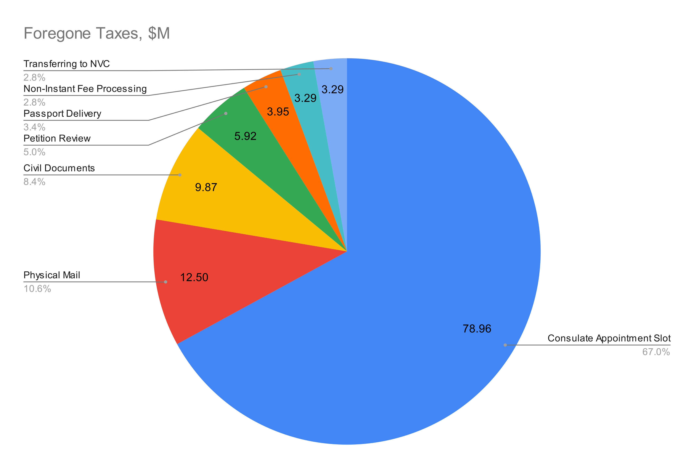
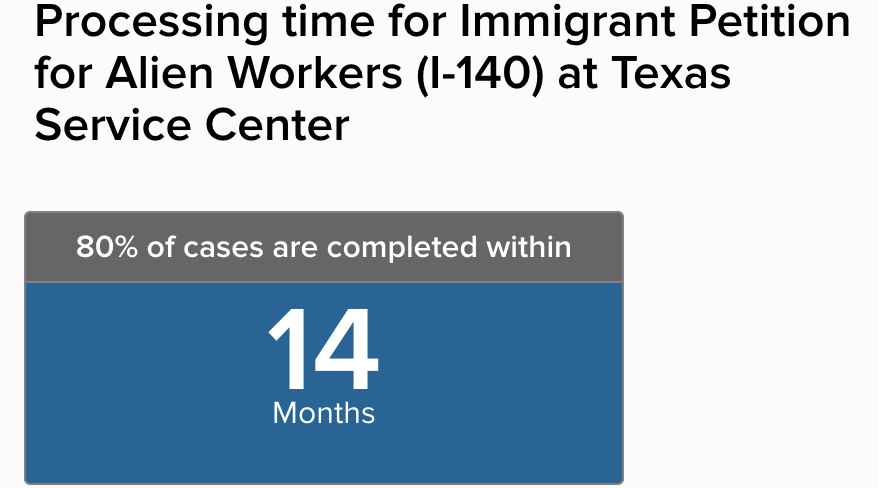

# How the EB-1A Process Should be Improved to Stop Losing $1.3 Billion Annually

<!--
5   0-5         Mailing the petition
9   5-14        Reviewing
5   14-19       Transferring to NVC
9   19-28       Mailing the NVC welcome letter
*1  28-29       Me not paying the fees
5   29-34       Fee processing
*8  34-42       Me not having the civil documents
5   42-47       Mailing the civil documents
15  47-62       Civil documents processing
266 62-328      Waiting for the interview
1   328-329     Printing the visa
4   329-333     Delivering the passport
1   333-334     Not picking up the passport due to bad wording
-->

## Calculating the Loss

It took me 334 days from submitting the petition
until I got my passport with the immigrant visa.
[See here](../1-process/README.md)
for the complete journal of that process.
Of them, 9 days were lost because
I didn't have some papers at hand.
Everything else was the inefficiency
of the United States government.

Not only did I lose 325 days of my life,
but also The United States forgone $27'000 in taxes
I would have paid if I immigrated
just after the approval of the petition
(conservatively assuming a $120k/year salary for a programmer).

Every year,
[80080](https://uscode.house.gov/view.xhtml?req=granuleid:USC-prelim-title8-section1153&num=0&edition=prelim)
EB-1 and EB-2 green cards are issued.
The government loses $120M every year if we assume the following (just a guess):
- Half of the applicants work abroad and don't pay US taxes until they immigrate.
- Half of those green cards are given to dependents who don't work.
- Those who work make 80 thousands a year.
- They pay 15% in taxes.
- The process takes 6 months on average.

Then annually it's

```math
40'040\:people \times 0.5 \times $80'000 \times 15\% \times \frac{6\:months}{12\:months} = $120M
```

This translates to **$1.3B of foregone GDP**
even with the [multiplier effect](https://ourworldindata.org/grapher/gdp-per-person-employed-constant-ppp) of a regular immigrant,
while those of extraordinary ability can generate way more.

This can be doubled because EB-2 wait significantly longer due to quotas,
but let's focus on fixing the inefficiency I've been through personally.

Cutting 1 day from the EB-1A process will yield:
- $658'000 in taxes annually.
- $7'200'000 in GDP annually.


## What Loses the Most



| Days | Forgone Taxes, $M | Forgone GDP, $M | Item                         |
|------|-------------------|-----------------|------------------------------|
| 120  | 78.96             | 864.0           | Consulate Appointment Slot   |
| 19   | 12.50             | 136.8           | Physical Mail                |
| 15   | 9.87              | 108.0           | Civil Documents Processing   |
| 9    | 5.92              | 64.8            | Petition Review              |
| 6    | 3.95              | 43.2            | Passport Delivery            |
| 5    | 3.29              | 36.0            | Non-Instant Fee Processing   |
| 5    | 3.29              | 36.0            | Transferring to the NVC      |

## Consulate Appointment Slot

**120 days**, can yield **$79M in Taxes** and **$864M in GDP**

While I waited for 266 days for my interview,
that was above average.
Let's assume it's 120 days, although I don't know exactly.

In Tbilisi where I had my interview
they had 3 interviewers on that day,
and they [issued](https://travel.state.gov/content/travel/en/legal/visa-law0/visa-statistics.html)
1164 visas in August 2023.
This means 388 visas per interviewer per month or 4656 per year.

Assume an EB-1/2 visa requires ten times the preparation
from the reviewer than an average visa.
Then a dedicated EB-1/2 interviewer can issue 465 visas per year.

Here's how we can cut the waiting time from 120 to 20 days for free.


| Variable | Value | Definition                                                                                                                                                      |
|----------|-|-----------------------------------------------------------------------------------------------------------------------------------------------------------------|
| $N_c$    | 86 | How many interviewers there would be if they were dedicated to EB-1/2. This is oversimplified as there are more embassies than that, but let's start from this. |
| $N$      | ? | The optimal number of interviewers                                                                                                                              |
| $S$      | 150'000 | An interviewer's salary, \$                                                                                                                                     |
| $M$      | 40'040 | The number of applicants annually                                                                                                                               |
| $T_c$    | 120 | The current median wait time of an applicant                                                                                                                    |
| $T$      | ? | The optimal median wait time of an applicant                                                                                                                    |
| $D$      | 16.44 | Tax gain per applicant per day, \$                                                                                                                              |


Assume each interviewer costs the budget $150k annually.
Each day an applicant saves brings in $16.44 in taxes the applicant pays once immigrated.
If we put all those gains into hiring additional interviewers,
we can optimize for the shortest median wait time
until hiring an additional interviewer is uneconomical.

From [The Queueing theory](https://en.wikipedia.org/wiki/Queueing_theory),
to cut the median wait time in half we need double the number of the interviewers
because they are inversely proportionate:

```math
\frac{T}{T_c} = \frac{N_c}{N}
```

The aggregate annual tax revenue gain from cutting the time from $T_c$ to $T$:

```math
R = (T_c - T) D M
```

If this gain is spent to hire more interviewers:

```math
\frac{R}{S} = N - N_c
```

Solving that for the number of the interviewers:

```math
N = \frac{T_c D M}{S} \approx 526
```

Which will cut the wait time down to

```math
T = T_c \frac{N_c}{N} \approx 19.6\:days
```

So if 526 additional interviewers
dedicated to this visa class are hired,
they will immediately be paid for
from the growing tax revenue,
and it will also add $720M to GDP.

That's oversimplified because the interviewers
are spread over
[153 consulates worldwide](https://travel.state.gov/content/travel/en/us-visas/visa-information-resources/list-of-posts.html),
and those 153 separate queues will fluctuate
significantly more than a single queue in our model,
but we could still cut about three months away.

The problem is in the paradigm.
In traditional governmental management,
they optimize for utilization of the employees,
and redundancy is unwanted.

This approach should be changed to that of business
where the redundancy is a tool for optimal overall performance.


## Physical Mail

**19 days** (a petition, a welcome letter, civil documents), can yield **$12.5M in Taxes** and **$136.8M in GDP**

With EB-1/2, the petition must be printed
and sent over physical mail.
Then a service center scans the petition,
and a reviewer reads the scanned document.

This is ridiculous.
If those $12.5M are invested into making this all-digital,
it will pay back in the first year,
and then those $12.5M will be available to the government every year.

Also, this will save a lot to the applicants.
I paid $333.60 to my agent to print the petition,
and then about $80 for the express postage
(I don't know the figure, it was included in my package).
That's about $10M annually.

Then think of the ecology improvements
from not printing 20 million pages
and not sending 100'000 boxes annually.


## Civil Documents Processing

**15 days**, can yield **$9.87M in Taxes** and **$108M in GDP**

The civil documents are actually reviewed
by an interviewer in an embassy.
But there is this stage to first send them
to The National Visa Center to verify.
No appointment is scheduled before that.

This check is shallow.
For instance, the NVC did not ask me
for the Certificate of No Impediment to Marriage
while it was required by the consulate,
because the protocols of the two differ.

It will be better to give an applicant an interview date
and check their documents in parallel.
There will still be about 20 days until the interview
if we optimize the number of reviewers.

Some applicants want to travel as soon as possible,
and they will take the risk
of not having their documents verified upfront
and being turned back at the interview.
Others will want the green light from the NVC
and take a longer wait for the interview
just to be sure of their papers.
This choice should be given to them.


## Petition Review

**9 days**, can yield **$5.92M in Taxes** and **$64.8M in GDP**

The actual review takes hours.
I guess, sometimes it takes minutes
from the quality of RFEs we sometimes get.

I don't know the total number of the reviewers,
so I can't compute the optimal number
as I did with the visa interviewers,
but there should be the same huge room for improvement.


## Passport Delivery

**6 days**, can yield **$3.95M in Taxes** and **$43.2M in GDP**

The visa should be made electronic,
so an applicant is given their passport back
after a successful interview and can travel immediately.

I understand that many parties need to check this visa,
from an airline staff to security agents.
Even the border officer in
[the country of Georgia](https://en.wikipedia.org/wiki/Georgia_(country))
as I was leaving the country for Turkey
asked me where I got this visa from and examined it
for a whole minute with a magnifying glass.
I'm not sure that was any business of her,
but the electronic visa should be verifiable
by all interested parties by scanning the passport.

Alternatively, if paper visa is to stick for a while,
printing can still be improved.
I don't mind not going home and waiting
for a few hours after the interview
for them to print my visa and give me the passport back.
There should not be any security problems with that
since we are barely allowed to carry anything
while in an embassy.
And it can also make business for McDonald's
who will open their branches in embassies
for applicants as they wait.


## Non-Instant Fee Processing

**5 days**, can yield **$3.29M in Taxes** and **$36M in GDP**

At various tages, the government accepts fees in 4 different ways:

- Petition review:
  - Cheques, or
  - Credit card authorization with G-1450 paper form.
- DS-260 immigrant visa fee:
  - Automated Clearing House Debit.
- USCIS immigrant fee:
  - Automated Clearing House Debit.
  - Debit or Credit card.

The slowest of those was the DS-260 fee.
It took 5 days and had no faster alternative.

Can you imagine Amazon taking 5 days to process a payment?

From the last step,
we know that government knows how to handle credit cards.
All payment methods should be available at all three payment stages.

I also don't know how long the first payment takes,
the fee for the petition review.
My 9 days of the petition review
probably included a day or two of cashing my cheques.

There is another concern.
The first two payments require a US bank account,
which is frustrating to foreigners who don't have one.
People have to use their friends' accounts,
and third parties charge hundreds of dollars
to provide their cheques for such payments.
This inefficiency feeds too much non-productive work.


## Transferring to the NVC

**5 days**, can yield **$3.29M in Taxes** and **$36M in GDP**

From the timestamps on the letters I got,
it somehow took 5 days from my approval
to the NVC sending me a Welcome Letter.

This should be purely electronic and instant.
I'm sure this can be done in under $3M,
which means this improvement will pay for itself in a year,
and then it will be pure gain for the government every year.


## Make All Processing Premium

My petition was dealt with in 9 days
because I paid extra $2500 for premium processing,
and it became even more expensive since.
Without that fee, people
[wait significantly longer](https://egov.uscis.gov/processing-times/):



If a work immigrant waits for 14 months,
the foregone tax is $7'000.
If a dedicated reviewer was hired
and paid $7'000 for two hours of reviewing the petition
(I don't know how long it takes),
that would still be more economical
than making the applicant wait
(since the earlier immigration
would also generate $154'000 in GDP).

**Non-premium processing is more expensive than premium one**.


## Shorter Formal Petitions

Petitions have hundreds to thousands of pages
because of the free form.
My petition required me to define GitHub,
then GitHub commits, GitHub stars,
to prove the credibility of StackOverflow, etc.
It's like coding in [Assembly](https://en.wikipedia.org/wiki/Assembly_language)
with only a minimal set building blocks.

You should publish a catalog of trusted sources,
whitelisted awards, and defined blocks that can be used
in a petition.
Say, if one is a founder of a project
with 10 thousand GitHub stars,
they should automatically qualify for the Contribution
or the Role criteria.

Another formal approach is used in
[The Global Talent Visa](https://www.gov.uk/global-talent)
of The United Kingdom.
It requires an applicant to prove their merit
in no more than 10 documents.
This cuts away people with less formal achievements like me,
but it simplifies the work for others.
As a result, lawyers for The Global Talent Visa are way cheaper
than those who assist with EB-1A.

Applicants should be given a choice
between the short formal format
and a free-form petition format that exists today.


## Security Checks in Parallel

Sometimes you know in advance that you need to run
a security check before you can issue a visa.
There is [a list of occupations](https://en.wikipedia.org/wiki/Technology_Alert_List)
that are required to go through it.

However, the check is only started after the interview.
A friend of mine waited for over 9 months for his interview
knowing that he would be delayed, and he was.

You already got all the information for the security check,
and the interview could barely give you anything new.
This workflow dates back to when you really needed to see the person
and could not do things remotely.
This is no longer the case.

Another friend of mine is waiting for over a year
for his clearance after the interview.
That's over $30k in foregone taxes.
You should have started the check
after seeing his documents from NVC.


## In-House Translation

Every document in foreign language must be translated
in a petition and in the package of civil documents required
for a visa interview.

This takes a lot of effort from an applicant
because they need to learn all about this from scratch.

Also, it's a security issue for the government
to rely on a translation provided by an applicant
because the translation could be bent.

With the modern AI,
you should just accept documents in any language
and run translation yourself instantly.

In the rare cases when you can't translate a document
you should issue a request for translation to the applicant.

The requirement for translation is especially frustrating
before the interview.
I [brought](../1-process/README.md#the-papers)
21 required documents with me,
and about 10 additional documents that could be needed.
When I was double-checking them 4 days before the interview,
I noticed I have forgotten one
and had to rush to obtain it.
If I could drop the 7 translations from my package,
I could have paid more attention to the really important originals.

I know a few people
who have overlooked some required documents
for their interview and were delayed because of that.
This is painful.


## Issue SSN Instantly

The SSN card arrives in about a week.
I've heard stories of people learning their SSN
before that by calling some governmental body.

An SSN is required for a lot of things
like passing a driving test or building up credit score.

The number should be given instantly.
It should be printed on an immigrant visa.
If this visa is a legal equivalent of a green card for the first year,
it should also be a legal equivalent of a social security card.

Some of the more conservative options:
- Print a card on arrival.
- Send a card together with the passport return.


## Refactor State.gov

There's no way to find anything on State.gov
unless you were given an exact link or jumped from Google.

Here is an example of duplicated data,
two lists of civil documents
required for the interview in the same country of Georgia
where I lived before I came to the US:
- https://travel.state.gov/content/travel/en/us-visas/Supplements/Supplements_by_Post/TBL-Tbilisi.html
- https://travel.state.gov/content/travel/en/us-visas/Visa-Reciprocity-and-Civil-Documents-by-Country/Georgia.html

To make things worse,
the page for the corresponding step of the visa process
only encourages you to read the first one,
while only the second one mentions
that two different police certificates are required.

There are all too many domains one should go through on various stages of the process:
- https://uscis.gov
- https://travel.state.gov
- https://ceac.state.gov
- https://ustraveldocs.com

It's unclear how they are related.
They may easily fall out of sync
as it happened in October 2024
when the old USTravelDocs.com was killed.
Back then, all links to its specific pages
spread all over other governmental websites,
emails, and paper handouts died.

I suggest hiring
[Artemy Lebedev](https://www.artlebedev.com) to refactor all of that.
He is a leading expert in user experience from my homeland.
He designed the most challenging things from
[maps](https://www.artlebedev.com/metro/map5/)
to [stadium and airport navigation](https://www.artlebedev.com/navigation/)
to [trains](https://www.artlebedev.com/metro/train/)
and [helicopters](https://www.artlebedev.com/scout/exterior/).


## Residency Without Travelling

The term of residency starts after entering the US
on an immigrant visa.
For me, this added 5 days to when I picked up my passport.

I want my citizenship faster,
and so those 5 days would have made a difference.
I wish I could start my legal residency right after the approval.

How exactly does my physical arrival make me more american?
Legally, I could have arrived, started my residency,
and 1 minute later go back to the country
I lived before to finish some business.
This means I would have purchased the earlier date
for $1500 (tickets), two lost business days,
and poor sleep.

If anything could be purchased like that,
it should be offered for free.

Some do want to start their residency later on
for legal reasons.
Therefore, an immigrant should be given a choice.


## Lift the Quotas

### Quotas by Country of Birth

According to [the law](https://uscode.house.gov/view.xhtml?req=granuleid:USC-prelim-title8-section1152&num=0&edition=prelim),
no more than 7% of immigrant visas can be given to people
born in one country of birth.
Most countries are below their quotas,
that's why my immigration was not delayed by that.
However, China, India, Mexico, and Philippines
[hit their quotas](https://travel.state.gov/content/travel/en/legal/visa-law0/visa-bulletin/2025/visa-bulletin-for-november-2024.html).

I have an Indian friend who is applying for EB-1A.
After his petition is approved
he will have to wait 2.5 years
until he can [submit his civil documents](../1-process/README.md#step-7-civil-documents).

The case with China is even more outrageous.
There are over 10 thousand brilliant Chinese
who want to move to the United States to work.
Their immigration will strengthen this country
and help our competition with China.
Each of them has an approved petition
with the section on why their immigration
would substantially benefit the United States in the future.
But we make them wait for 2 years longer than I had to.

There is
[an act](https://www.congress.gov/bill/118th-congress/house-bill/6542)
currently in Congress to drop this quota.
It should be passed.

### Overall Quotas

The quotas per year are:
- 40040 EB-1 green cards.
- 40040 EB-2 green cards.

In August 2004, the EB-1
[hit their limit](https://travel.state.gov/content/travel/en/News/visas-news/annual-limit-reahed-in-the-eb-1-category.html).
This halted everything and made applicants wait for 34 days
until the quota refreshed on October 1.

The EB-2 is permanently above the quota,
so people have to wait in line for
[18 months](https://travel.state.gov/content/travel/en/legal/visa-law0/visa-bulletin/2025/visa-bulletin-for-november-2024.html)
if they are lucky to not be hit by the country-of-birth-quota.

This is not how things should work.
If someone is qualified and will benefit The United States,
they should be able to move immediately.
There is no reason to delay the benefit to this country.

To manage the influx,
the proper tool is setting a specific bar
for each program.
Managing the influx with anything other than the bar
leads to less qualified people taking the place
of more qualified ones who learned about the program later.

Say you want 40040 qualified people annually under EB-2.
Currently, you have
[384'683 approved people](https://www.uscis.gov/sites/default/files/document/data/eb_i140_i360_i526_performancedata_fy2024_q3.xlsx)
awaiting their quota in a runaway queue.
Next year, you will welcome 40040 of them,
not the best ones you could get, but just the first 40040.
Why taking in less qualified people than you can?

Alright, these should all be taken in since we promised them that,
but we either should decide that we want more of them at the same bar
or raise the bar.


## Interview After Immigration

In the simplest terms, the EB-1/2 is a two-step process:

1. Prove you are good with your petition.
2. Prove you are not bad in an interview.

From what I know, about 95% of the people
with an approved petition get their visa approved
either immediately at the interview
or after a subsequent security check.

Because of those 5% of denials,
everyone else has to suffer long months.
Don't forget that an approved petition means
that The United States recognizes one
as an alien of the extraordinary ability.

If you really can think out of the box
and truly want to make The United States
flourish and prosper fast,
then my radical far-centrist suggestion
is to let people in
immediately after their petition is approved.

The steps would be the following:
1. After a petition is approved,
   the applicant's passport gets into the database
   accessible by the Customs and Border Protection.
2. The applicant can choose whether they want to:
   - Move right away to be vetted after arrival
     (this is the default immediately available), or
   - Go through the old and safe process
     of vetting before their immigration.
     The upside is that they know
     whether they are eligible
     before they invest into relocation
     (except that [not really](https://www.imdb.com/title/tt22964884/)).
     This is an opt-in.
3. At arrival, an immigrant shows only their passport
   at the port of entry.
4. The immigrant makes a security deposit
   to compensate for legal procedures
   if they are later found ineligible but refuse to go.
5. The immigrant is granted a temporary legal status.
   - In the mainstream case of approval, this status is retroactively
     converted to that of a permanent resident.
   - In the rare case of denial, this status is retroactively
     converted to a 'work visa' status
     and expires soon after the deadline for appealing.

In no way is this less secure than what we have now
with the open border and unvetted people
coming and staying permanently without any record.

In no way is this less convenient to those
who want no surprises
and who would rather wait for a few more months
in their homeland for an interview
than take a 5% chance of having to go
a couple of months after arrival.

Many mobile people like me would give a lot
to start their residency in December 2023
rather than November 2024.
Hell, I would even wear a security bracelet
for a few months if I had to.

Those 5% who are denied are mostly aware
of being in a high-risk group
for having a criminal record
or misrepresenting something in their petitions.
So for genuine immigrants
the chance of having to go back is even less than 5%.

There's a counter-argument that it's cruel
to give people hope and then take it away.
To that I should say that there's a bitter flip-side
to this policy.
The hesitation to force people out
breaks human lives just as well.

For instance, I was denied tourist visas to Australia and
[The United Kingdom](https://medium.com/@alexey.inkin/12-things-to-be-fixed-in-the-uk-visa-processing-based-on-my-refusal-1447570c42b1),
both ruled I covertly wanted to overstay.
In a sane society, you would just track down and expel
those who break the law.
But the radical left in the UK cares so much
to protect the wild criminals of alien culture who made it in
that the only way for their government to counter that
is this blind policy to deny a chance
to a culturally-close intelligent person
with no criminal record.
This is insane.

For another example, my brother
was denied a tourist visa to The United States.
They ruled he had no ties to his homeland
and would likely overstay.
They ignored the fact that he already was in The United States
as a tourist on the height of
[the war](https://en.wikipedia.org/wiki/Russian_invasion_of_Ukraine)
when [the mobilization](https://en.wikipedia.org/wiki/2022_Russian_mobilization) was announced.
It was the most straightforward day
for a Russian to stay and seek asylum,
no judge would doubt that the claim was genuine.
However, he had not done that and left the US on time.

In the ideology of care-for-the-oppressed-no-matter-what,
the *Care* is blind and shallow.
It's a drug they take to feel good about themselves,
to think in line with the majority,
and to not having to learn how painful the flip-sides are.

You must never deny person this contract:

> I'm willing to accept the risk of having to go
and allow you to apply force if I change my mind
and charge me for that.


## Drop the Licensing Requirements to Lawyers

I got to know tens of people on various stages
of the immigration process.
Some of them work with licensed lawyers
while others work with unlicensed experts and assistants.

From their stories,
lawyers are only preferred for complicated legal issues
like changing a status with past violation or after a deadline,
or taking the case to court.

An average lawyer is nearly uninvolved with a case,
and all work is done by their paralegals
which are often poorly supervised.
A lawyer often merely capitalizes on their license.
There is no guarantee a lawyer is better
than an unlicensed expert.
I can't really recommend any lawyer
while some of the best people
that I know in the market are unlicensed.

They should be allowed to do everything
a lawyer is allowed to do
if they inform a customer about their status.
In a free country, customers should be free
to choose those who do the job best for them.


## Non-Economical Concerns

When I filed my petition, I was 38.289 years old.
When I received my passport with a visa, I was 39.202 years old.
It took 0.913 years of my life.

I'm [not going to die](https://x.com/bryan_johnson),
but the government counts on us being productive until say 70.
I lost 2.9% of the anticipated production lifespan I had left.
Is this really how you want your extraordinary ability immigrants?

Each one of us is required to prove
that the US will benefit from our immigration.
There is a dedicated section on that in every petition.
Instead, we are wasted, and that's disrespect.

Also, I was single and tried to avoid relationships
after my petition was approved
because I knew getting a girlfriend in the process
could raise suspicion of fake marriage,
and there are many cases of visa denial based on that.
That's a very disturbing dilemma to impose on your immigrants.

If I was a woman, I would be fertile until 47 at best.
In that case, the process that long would cut 10.48%
of the time I had left to have kids.

A friend of mine fears his daughter reaches 21
before they move
and that she won't get her green card as part of the family.

Some pregnant women dream of their kid
becoming a president, but then they need to be in the US
before they give birth.

I'm sure some people in Ukraine
had their petition approved before the war escalated in 2022
but were trapped because they could not get their visa
before the border was sealed.

Personal stories behind the papers can be dreadful.
Please try to bring us in faster.
And we will help you become great again.


## Hire Me To Improve This Process

I want to work for The Department of Government Efficiency.
I want brilliant people to come to work in this country. Fast.
I want everyone's life be easier.

I hope that from my writing you can see why I qualify.
Please, get in touch:
https://www.linkedin.com/feed/


## Thank You!

This article is a part of the series:

1. **[The Process](../1-process/README.md)**.  
   Every form I filed, every response I got,
   and every screenshot in the process
   up to my arrival in the US.
2. **[The Petition](../2-petition/README.md)**.  
   Download my entire petition and read
   how I chose my criteria and what to submit for them.
3. **Improvements to the Process I suggest [You Are Here]**.  
4. **[How I can help you with your petition](../4-help/README.md)**.  
   I can answer any questions that do not require a lawyer's license,
   try to evaluate your profile for the EB-1A program,
   give you career advice that would strengthen your profile for the program,
   proofread your petition, and more.

Read them all.
Follow me to keep in touch:

- Telegram: https://t.me/ainkin_com
- Twitter: https://x.com/AlexeyInkin
- LinkedIn: https://www.linkedin.com/in/alexey-inkin/
- Instagram: https://www.instagram.com/alexey.inkin/
- Facebook: https://www.facebook.com/alexey.inkin
- VK: https://vk.com/ainkin
