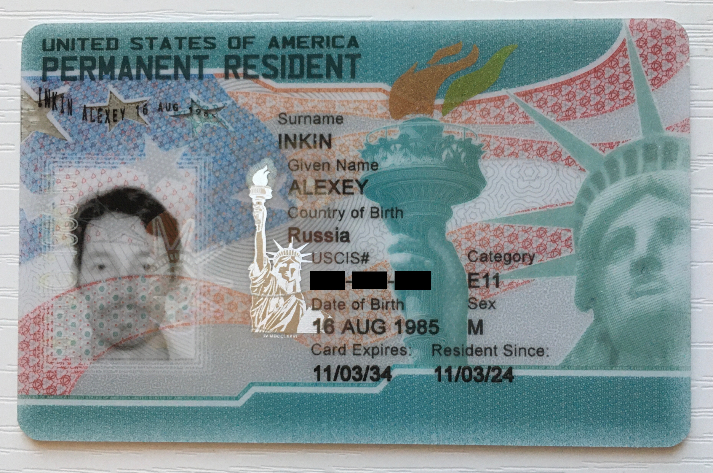

# How I got EB-1A green card for extraordinary ability

I was approved for a United States green card for extraordinary ability in science (I am a programmer)
in 2024.

This is the most complete and detailed free instruction on this program you will find online.
It includes my complete petition with only a few private things blacked out,
every form I filled out, and every piece of interaction with each of the United States bodies I went through.
All that said, **I am not a lawyer, and none of this is legal advice**.

What makes this program stand out is that it doesn't require any job offers, relatives, or other invitations.
It's also not a lottery, and every applicant who is found eligible gets a green card.
One just needs to write out the proof of their extraordinary ability against formally defined criteria
and go through some paperwork and vetting.
This gives the most freedom before and after immigration, that's why I have chosen it.

There is a misconception that this program is for Nobel-prize-winners-grade. It is not.
The quota for this program is over 40 thousand green cards a year,
and many diligent people can qualify if they put effort.

To name a few more advantages, you can take your spouse and unmarried children under 21 with you,
and all of you become permanent residents of the United States immediately after crossing the border.
All of you can work, study, or do almost anything else that citizens can except for voting, right away.
You don't need to report to anyone after that and can apply for citizenship in 5 years.

There are four parts in my material on this.

## [1. The Process](1-process/README.md)

Here is my timeline, every form I filled out,
and every piece of interaction with each of the United States bodies I went through.
[Read my process here](1-process/README.md).

## [2. The Petition](2-petition/README.md)

My complete petition with only a few private things blacked out,
the process of writing it, my strategy for each criterion, and all the reasoning. [Read my petition here](2-PETITION.md).

## [3. Improvements to the Process I Suggest](3-improvements/README.md)

If you work for the Department of Government Efficiency,
read my suggestions on how to get the process from months to days
and gain millions from immigrants paying their taxes early.
[Read my suggestions here](3-improvements/README.md).

## [4. How I Can Help You With Your Immigration](4-help/README.md)

I can answer any questions that do not require a lawyer's license,
try to evaluate your profile for the EB-1A program,
give you career advice that would strengthen your profile for the program,
proofread your petition, and more. [Read it here](4-help/README.md)

# Questions?

I started a chat to answer them all:

- https://t.me/eb1a_chat

Join and feel free just to say "Hi!"
I like to hear from those who want to come to this great country!

# Follow Me

Follow me to keep in touch:

- Telegram: https://t.me/ainkin_com
- Twitter: https://x.com/AlexeyInkin
- LinkedIn: https://www.linkedin.com/in/alexey-inkin/
- Instagram: https://www.instagram.com/alexey.inkin/
- Facebook: https://www.facebook.com/alexey.inkin
- VK: https://vk.com/ainkin

